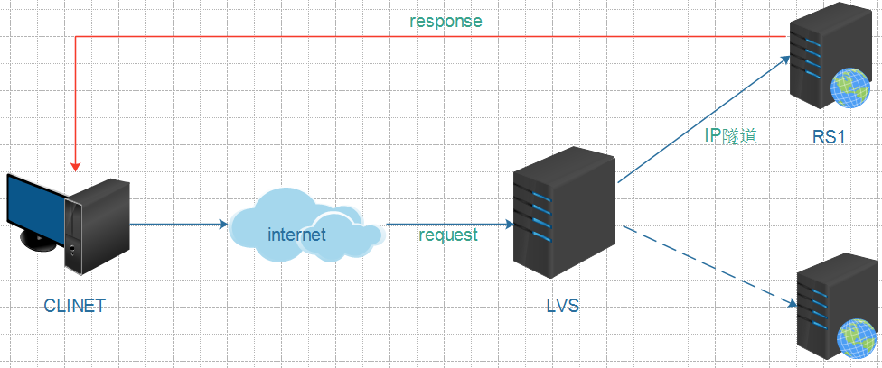
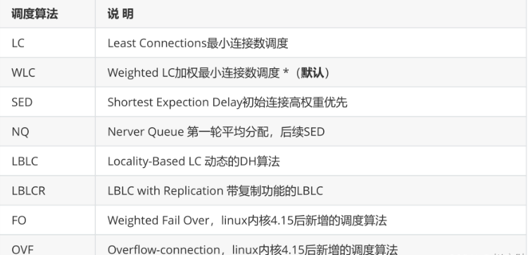

# 1 构建高可用集群

## 1.1 什么是高可用集群

高可用集群（High Availability Cluster，简称HA Cluster），是指以减少服务中断时间为目的得服务器
集群技术。它通过保护用户得业务程序对外部间断提供的服务，把因为软件，硬件，认为造成的故障对
业务得影响降低到最小程度。总而言之就是保证公司业务7*24小时不宕机

### 1.2 高可用衡量标准

衡量集群的可用性(HA)高低，可以从MTTF（平均无故障时间）和MTTR（平均故障维修时间）进行考
量，公式为：HA=MTTF/(MTTF+MTTR)*100%，具体衡量标准可以参考下表


### 1.3 高可用保障

对集群中的服务器进行`负载均衡`、`健康监测`，并在服务器出现故障时能进行`故障转移`，自动切换到正常
服务器`是高可用保障的必要手段`

### 1.3.1 负载均衡

常见的负载均衡手段如下：
硬件负载均衡，如`F5`
软件负载均衡，如`nginx、haproxy、lvs`
几种软件负载均衡技术比较:


### 1.3.2 健康监测和自动切换

常见的健康监测和自动切换软件有keepAlived和heartBeat，其二者对比如下:
Keepalived使用更简单：从安装、配置、使用、维护等角度上对比，Keepalived都比Heartbeat要简单
Heartbeat功能更强大：Heartbeat虽然复杂，但功能更强大，配套工具更全，适合做大型集群管理，
而Keepalived主要用于集群倒换，基本没有管理功能.


## 1.4 高可用拓扑图

# 2 软件负载均衡技术LVS

## 2.1 LVS简介

### 2.1.1 什么是lvs

础知识:网络协议必知必会
LVS是Linux Virtual Server的简写，在1998年5月由章文嵩博士成立。
工作在OSI模型的四层，基于IP进行负载均衡。
在linux2.2内核时，IPVS就已经以内核补丁的形式出现。
从2.4版本以后，IPVS已经成为linux官方标准内核的一部分。
a. lvs项目介绍 http://www.linuxvirtualserver.org/zh/lvs1.html
b. lvs集群的体系结构 http://www.linuxvirtualserver.org/zh/lvs2.html
c. lvs集群中的IP负载均衡技术 http://www.linuxvirtualserver.org/zh/lvs3.html
d. lvs集群的负载调度 http://www.linuxvirtualserver.org/zh/lvs4.html
e. lvs中文站点 http://zh.linuxvirtualserver.org

### 2.1.2 lvs官方资料链接

## 2.2 lvs拓扑

### 2.2.1 lvs术语

LVS服务器(DS)
集群中节点服务器(RS)
虚拟IP地址（VIP），用于向客户端提供服务的IP地址（配置于负载均衡器上）

真实服务器的IP地址（RIP）， 集群中节点服务器的IP地址

负载均衡器IP地址（DIP），负载均衡器的IP地址，物理网卡上的IP

客户端主机IP地址（CIP），终端请求用户的主机IP地址

### 2.2.2 工作原理和拓扑图

LVS负载均衡调度技术是在linux内核中实现的，使用配置LVS时，`不是直接配置内核中的IPVS`，而是通
过IPVS的管理工具`IPVSADM来管理配置`，LVS集群负载均衡器接受所有入站客户端的请求，并根据算法
来决定由哪个集群的节点来处理请求。


## 2.3 lvs的四种工作模式

### 2.3.1 TUN模式

TUN(Tunneling)模式需要服务器支持IP隧道（IP tunneling）技术，`限制较大，一般不用。`



### 2.3.2 NAT模式

AT(Network Address Translation)模式是基于NAT技术实现的。在此模式中，`LVS服务器既要处理请 求的接入，又要处理请求的响应。因此存在较大的性能瓶颈。`


### 2.3.3 DR模式

DR(Direct Routing)模式是`LVS的默认工作模式，也叫直接路由模式。`只处理请求的接入，不处理请求的
响应。`因此性能高，瓶颈小。`


### 2.3.4 FULLNAT模式

FULLNAT( Full Network Address Translation)可以说是淘宝定制化的技术，linux内核不支持。

## 2.4 LVS调度算法

## 2.4.1 静态调度算法


### 2.4.2 动态调度算法



## 2.5 lvs基本命令

对于lvs的操作，主要是通过ipvsadm软件实现，常用的lvs操作命令如下:

### 2.5.1 集群服务管理


### 2.5.2 集群RS管理


## 2.6 lvs实战

### 2.6.1 NAT模式实战


```bash
vi /etc/sysctl.conf
#添加如下内容并保存退出
net.ipv4.ip_forward = 1
#执行如下命令使修改生效
sysctl -p
```

```bash
#指定负载80端口的VIP，并指定调度策略为轮询
[root@lvs01 ~]# ipvsadm -A -t 10.0.0.8:80 -s rr
#添加两台RS，并指定负载均衡工作模式为NAT
[root@lvs01 ~]# ipvsadm -a -t 10.0.0.8:80 -r 192.168.25.112 -m
[root@lvs01 ~]# ipvsadm -a -t 10.0.0.8:80 -r 192.168.25.113 -m
#查看上述配置是否生效
[root@lvs01 ~]# ipvsadm -Ln
IP Virtual Server version 1.2.1 (size=4096)
Prot LocalAddress:Port Scheduler Flags
 -> RemoteAddress:Port      Forward Weight ActiveConn InActConn
TCP  10.0.0.8:80 rr
 -> 192.168.25.112:80      Masq   1    0      0    
 -> 192.168.25.113:80      Masq   1    0      0
```

NAT模式存在的问题–>LVS性能瓶颈

### 2.6.2 DR模式实战

ARP（Address Resolution Protocol）地址解析协议，是根据IP地址获取物理地址
（MAC）的一个 TCP/IP协议。主机发送信息时将包含目标IP地址的ARP请求广播到局域网络上的
所有主机，并接收返 回消息，以此确定目标的物理地址；收到返回消息后将该IP地址和物理地址
存入本机ARP缓存中并 保留一定时间，下次请求时直接查询ARP缓存以节约资源。
DR模式拓扑图


### 2.6.3 四个问题

a. 如果LVS服务器挂了会出现什么问题?
b. 如何进行故障转移、自动切换?
b. 如果后端某台RS服务器挂了会出现什么问题？
d. 如何获知RS服务器状态?

# 3 KeepAlived

## 3.1 keepAlived简介

Keepalived的作用是检测服务器状态，如果有一台web服务器宕机，或工作出现故障，Keepalived将检
测到，并将有故障的服务器从系统中剔除，同时使用其他服务器代替该服务器的工作，当服务器工作正
常后Keepalived自动将服务器加入到服务器群中

## 3.2 keepAlived主要特点

### 3.2.1 健康检查


### 3.2.2 故障迁移

VRRP协议
在现实的网络环境中。主机之间的通信都是通过配置静态路由或者(默认网关)来完成的，而主机之间的
路由器一旦发生故障，通信就会失效，因此这种通信模式当中，路由器就成了一个单点瓶颈，为了解决
这个问题，就引入了VRRP协议。
VRRP协议是一种容错的主备模式的协议，保证当主机的下一跳路由出现故障时，由另一台路由器来代
替出现故障的路由器进行工作，通过VRRP可以在网络发生故障时透明的进行设备切换而不影响主机之
间的数据通信。
故障迁移原理
在 Keepalived 服务正常工作时，主 Master 节点会不断地向备节点发送（多播的方式）心跳消息，用
以告诉备 Backup 节点自己还活着，当主 Master 节点发生故障时，就无法发送心跳消息，备节点也就
因此无法继续检测到来自主 Master 节点的心跳了，于是调用自身的接管程序，接管主 Master 节点的
IP 资源及服务。而当主 Master 节点恢复时，备 Backup 节点又会释放主节点故障时自身接管的 IP 资源
及服务，恢复到原来的备用角色。

## 3.3 keepAlived原理

## 3.4 分布式选主策略

### 3.4.1 仅设置priority

在一个一主多备的Keepalived集群中，priority值最大的将成为集群中的MASTER节点，而其他都是
BACKUP节点。在MASTER节点发生故障后，BACKUP节点之间将进行“民主选举”，通过对节点优先级值
priority和weight的计算，选出新的MASTER节点接管集群服务。

### 3.4.2 设置priority和weight

weight值为正数时
在vrrp_script中指定的脚本如果检测成功，那么MASTER节点的权值将是weight值与priority值之和；如
果脚本检测失效，那么MASTER节点的权值保持为priority值
MASTER 节点vrrp_script脚本检测失败时，如果MASTER节点priority值小于BACKUP节点weight值与
priority值之和，将发生主、备切换。
MASTER节点vrrp_script脚本检测成功时，如果MASTER节点weight值与priority值之和大于BACKUP节
点weight值与priority值之和，主节点依然为主节点，不发生切换。

weight值为负数时
在vrrp_script中指定的脚本如果检测成功，那么MASTER节点的权值仍为priority值，当脚本检测失败
时，MASTER节点的权值将是priority值与weight值之差
MASTER节点vrrp_script脚本检测失败时，如果MASTER节点priority值与weight值之差小于BACKUP节
点priority值，将发生主、备切换。
MASTER节点vrrp_scrip脚本检测成功时，如果MASTER节点priority值大于BACKUP节点priority值时，
主节点依然为主节点，不发生切换。

weight设置标准
对于weight值的设置，有一个简单的标准，即weight值的绝对值要大于MASTER和BACKUP节点priority
值之差。由此可见，对于weight值的设置要非常谨慎，如果设置不好，主节点发生故障时将导致集群角
色选举失败，使集群陷于瘫痪状态。