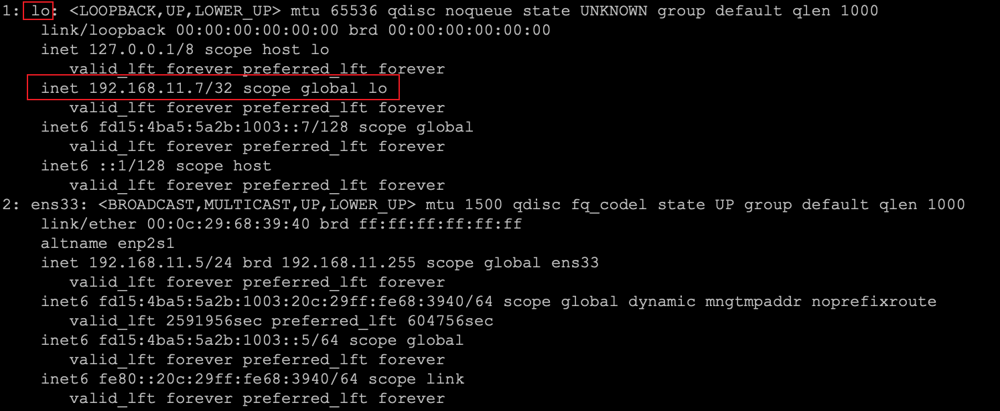
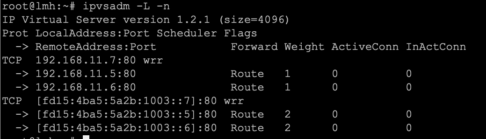
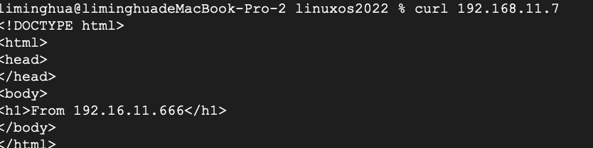

# 1.物理机器（4台）


```bash
VIP:192.168.11.7
K1:192.168.11.3
K2:192.168.11.4
NG1:192.168.11.5
NG2:192.168.11.6
```

# 2.K1

```bash
apt install -y keepalive
```

## Keepalived.conf

/etc/keepalived/keepalived.conf

```
global_defs {
        notification_email {
        39820581@qq.com
    }
    #notification_email_from guoxm@puzek.com
    #smtp_server smtp.mxhichine.com
    #smtp_connect_timeout 30
    vrrp_mcast_group4 224.0.0.18
    router_id LVSMASTER

}

vrrp_instance VI_1 {
    state MASTER
    interface ens33
    virtual_router_id 137
    priority 7
    advert_int 3
    authentication {
        auth_type PASS
        auth_pass abclmh
    }
    virtual_ipaddress {
        192.168.11.7/24 dev ens33
    }
    virtual_ipaddress_excluded {
        fd15:4ba5:5a2b:1003::7/128 dev ens33
    }
}

# http
virtual_server 192.168.11.7 80 {
    delay_loop 6 #每隔6秒检查一次real server状态
    lb_algo wrr
    lb_kind DR   #LVS 集群模式
   # persistence_timeout 50
    protocol TCP
    real_server 192.168.11.5 80 {
        weight 1
        TCP_CHECK {
            connect_timeout 3
            }
        }
    real_server 192.168.11.6 80 {
        weight 1
        TCP_CHECK {
            connect_timeout 3
            }
        }

}
virtual_server fd15:4ba5:5a2b:1003::7 80 {
    delay_loop 6 #每隔6秒检查一次real server状态
    lb_algo wrr
    lb_kind DR   #LVS 集群模式
   # persistence_timeout 50
    protocol TCP
    real_server fd15:4ba5:5a2b:1003::5 80 {
        weight 2
        TCP_CHECK {
            connect_timeout 3
            }
        }
    real_server fd15:4ba5:5a2b:1003::6 80 {
        weight 2
        TCP_CHECK {
            connect_timeout 3
            }
        }

}
```

## k2

```bash
global_defs {
        notification_email {
        39820581@qq.com
    }
    #notification_email_from guoxm@puzek.com
    #smtp_server smtp.mxhichine.com
    #smtp_connect_timeout 30
    vrrp_mcast_group4 224.0.0.18
    router_id LVSMASTER

}

vrrp_instance VI_1 {
    state MASTER
    interface ens33
    virtual_router_id 137
    priority 8
    advert_int 3
    authentication {
        auth_type PASS
        auth_pass abclmh
    }
    virtual_ipaddress {
        192.168.11.7/24 dev ens33
    }
    virtual_ipaddress_excluded {
        fd15:4ba5:5a2b:1003::7/128 dev ens33
    }
}

# http
virtual_server 192.168.11.7 80 {
    delay_loop 6 #每隔6秒检查一次real server状态
    lb_algo wrr
    lb_kind DR   #LVS 集群模式
   # persistence_timeout 50
    protocol TCP
    real_server 192.168.11.5 80 {
        weight 1
        TCP_CHECK {
            connect_timeout 3
            }
        }
    real_server 192.168.11.6 80 {
        weight 1
        TCP_CHECK {
            connect_timeout 3
            }
        }

}
virtual_server fd15:4ba5:5a2b:1003::7 80 {
    delay_loop 6 #每隔6秒检查一次real server状态
    lb_algo wrr
    lb_kind DR   #LVS 集群模式
   # persistence_timeout 50
    protocol TCP
    real_server fd15:4ba5:5a2b:1003::5 80 {
        weight 2
        TCP_CHECK {
            connect_timeout 3
            }
        }
    real_server fd15:4ba5:5a2b:1003::6 80 {
        weight 2
        TCP_CHECK {
            connect_timeout 3
            }
        }

}
```

# 3.nginx

## 1.为lo增加地址VIP

```bash
# This is the network config written by 'subiquity'
network:
  ethernets:
    ens33:
      addresses:
      - 192.168.11.5/24
      - fd15:4ba5:5a2b:1003::5/64
      gateway4: 192.168.11.1
      nameservers:
        addresses:
        - 10.6.6.6
        search:
        - lzhit.edu.cn
    lo:
      addresses:
      - 192.168.11.7/32
      - fd15:4ba5:5a2b:1003::7/128
  version: 2
```

## 2./etc/sysctl.conf

```bash
net.ipv4.conf.lo.arp_ignore = 1
net.ipv4.conf.lo.arp_announce = 2
net.ipv4.conf.all.arp_ignore = 1
net.ipv4.conf.all.arp_announce = 2
net.ipv4.conf.default.arp_ignore = 1
net.ipv4.conf.default.arp_announce = 2
```

记得 执行sysctl  -p

其他的RealServers除了自身的IP不一样以外，其他都一样

# 4.结果

keepalive


ng



ipvsadm -L -n



实际测试结果：



