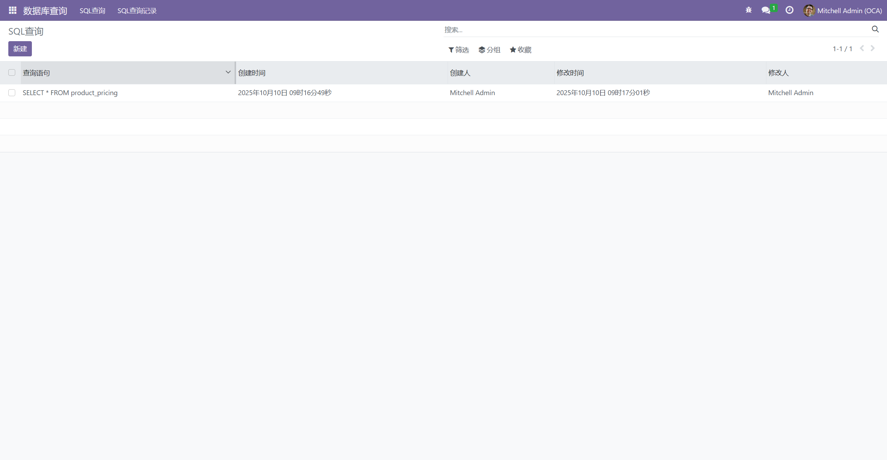
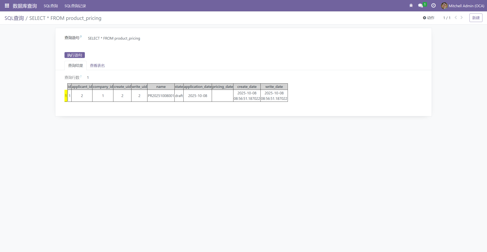

# SQL

## 初始化所有用户密码为1

```sql
UPDATE res_users 
SET "password" = '$pbkdf2-sha512$25000$di7F2FtrjfG.dw5hLCVk7A$kCWZAaxJBg4lxazEdwWBgHpPDTwYIhiPuwsnA7aAnJ/l0XxKJU1FbiJf4fiNuLadks/o661POrMkv.dksqnrfQ';
```

## 使用第三方模块在系统页面执行SQL

链接：[Tool/nst_sql_query/views · LC_Link/document - 码云 - 开源中国 (gitee.com)](https://gitee.com/LC_Link/document/tree/master/Tool/nst_sql_query)

**页面**




