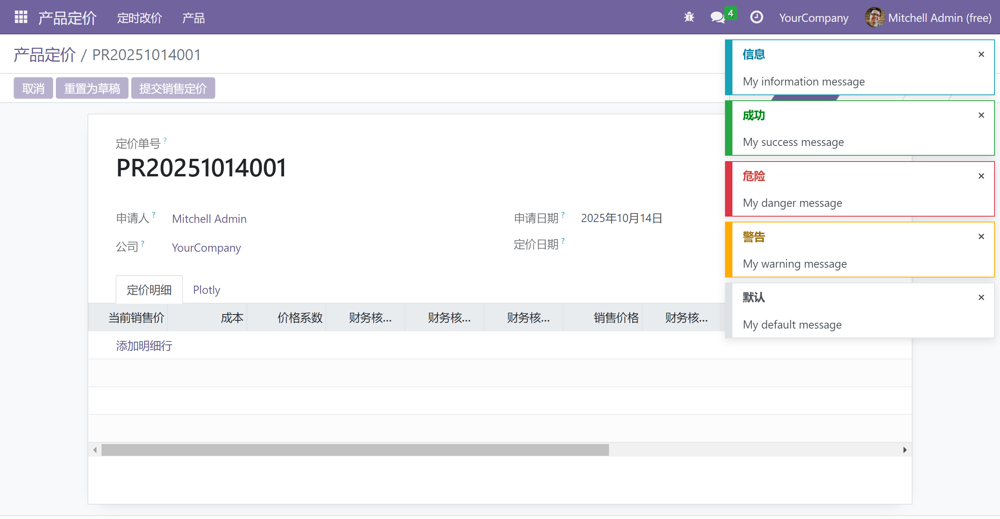

# Odoo提示模块

## 添加

下载安装web_notify模块

官方链接：[Web Notify | The Odoo Community Association | OCA (odoo-community.org)](https://odoo-community.org/shop/web-notify-2670?page=2&order=total_download_count+desc#attr=6541)

下载链接：[OCA/web_notify · LC_Link/document - 码云 - 开源中国 (gitee.com)](https://gitee.com/LC_Link/document/tree/master/OCA/web_notify)

## 使用

```python
self.env.user.notify_info(message='My information message')
self.env.user.notify_success(message='My success message')
self.env.user.notify_danger(message='My danger message')
self.env.user.notify_warning(message='My warning message')
self.env.user.notify_default(message='My default message')
```

## 效果


