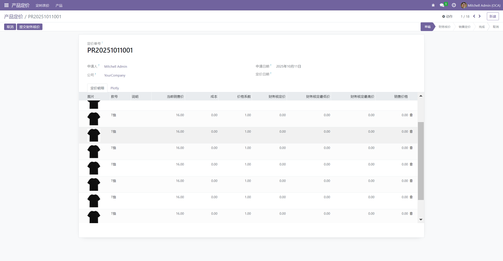

# 固定form视图的tree表头

> 通过限制高度，下拉滚动实现

参考代码地址：[Module/lc_scroll_tree_view · LC_Link/document - 码云 - 开源中国 (gitee.com)](https://gitee.com/LC_Link/document/tree/master/Module/lc_scroll_tree_view)

## 创建编辑scss样式

目录：lc_scroll_tree_view/static/src/style.scss

> overflow-y: scroll; 强制出现y轴方向滚动条
> 
> overflow-y: auto：当行数溢出时才会出现y轴方向滚动条

```scss
.scroll-tree-view {
  &.o_list_renderer {
    height: 500px;
    overflow-y: scroll;

    .table {
      > thead {
        z-index: 10;
        position: sticky;
        top: 0;
      }
    }
  }
}
```

## 在样式所在模块的__manifest__.py引入scss

```python
'assets': {
    'web.assets_backend': [
        "lc_scroll_tree_view/static/src/**/*",
    ],
},
```

## 在tree引入样式

```xml
class="scroll-tree-view"
```

## 效果

