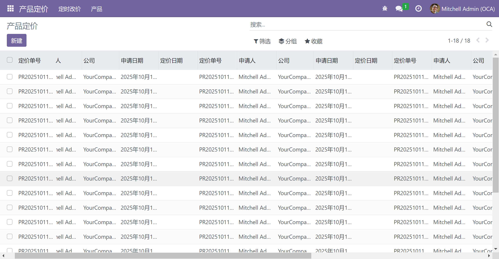

# 冻结tree视图第一列

> 如果模型字段很多，其tree视图需要展示过多的字段，在滑动查看字段的同时希望冻结第一列，例如生产订单单号等字段

## 创建编辑scss样式

目录：lc_list_freeze/static/src/list_freeze.scss

```scss
.o_list_renderer.freeze {
  .o_list_table {
    thead {
      z-index: 10!important;
    }

    thead, tbody, tfoot {
      tr {
        th.o_list_record_selector {
          position: sticky !important;
          z-index: 10 !important;
          left: 0 !important;

          + th {
            position: sticky !important;
            z-index: 10 !important;
            left: 39.1px !important;
          }
        }

        td.o_list_record_selector {
          position: sticky !important;
          z-index: 1;
          left: 0 !important;

          + td {
            position: sticky !important;
            z-index: 1;
            left: 39.1px !important;
          }
        }

        th.o_list_record_selector,
        th.o_list_record_selector + th {
          background-color: var(--ListRenderer-thead-bg-color);
        }

        td.o_list_record_selector,
        td.o_list_record_selector + td {
          background-color: white;
        }

        th:not(.o_list_record_selector):first-child {
          position: sticky !important;
          z-index: 10 !important;
          left: 0 !important;
          background-color: var(--table-bg) !important;
        }

        td:not(.o_list_record_selector):first-child {
          position: sticky !important;
          z-index: 1;
          left: 0 !important;
          background-color: white !important;
        }
      }

      tr.o_data_row_selected {
        td.o_list_record_selector,
        td.o_list_record_selector + td {
          background-color: var(--table-bg) !important;
        }
      }
    }
  }
}
```

## 在__manifest__.py中引入

```python
'assets': {
    'web.assets_backend': [
        "lc_list_freeze/static/src/list_freeze.scss",
    ],
},
```

## 在tree中使用

在对应模块的tree视图使用样式

```xml
  <tree string="" class="freeze"><tree/>
```

## 效果




