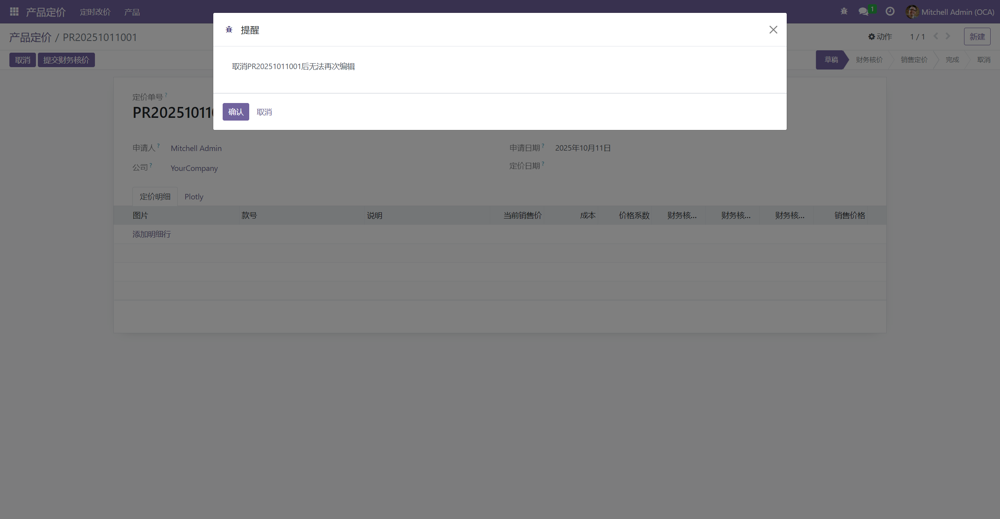

# 弹窗提醒

> 通过写一个瞬态模型达到实现弹窗提醒的功能，点击确认继续执行，点击取消撤回该操作。

参考代码链接：[Module/lc_tip_dialog · LC_Link/document - 码云 - 开源中国 (gitee.com)](https://gitee.com/LC_Link/document/tree/master/Module/lc_tip_dialog)

## 创建

### 弹窗模块

> 可以写在需要弹窗功能的模块下面，也可写成公共模块  

**目录结构**

```shell
├─security
│  └─ir.model.access.csv
│
├─wizard
│  └─__init__.py
│  └─tips_dialog.py
│  └─tips_dialog.xml
│
├─__init__.py
│
└─__manifest__.py
```

### 编辑tips_dialog.py瞬态模型

```python
from odoo import models, fields


class TipsDialog(models.TransientModel):
    _name = 'lc.tips.dialog'
    _description = '提示弹窗'

    title = fields.Char(string='Title')
    content = fields.Html(string='Content')

    res_model = fields.Char(string='Resource Model')
    res_ids = fields.Char(string='Resource IDs')
    context = fields.Char(string='Context')

    ok_func = fields.Char(string='Ok Function')
    no_func = fields.Char(string='No Function')

    def eval(self, func):
        self.ensure_one()
        if self.res_model and self.res_ids and func:
            res = self.env[self.res_model].browse(eval(self.res_ids))
            if res and res.__getattribute__(func):
                if self.context:
                    res = res.with_context(eval(self.context))
                return res.__getattribute__(func)()

    def action_ok(self):
        result = self.eval(self.ok_func)
        return result

    def action_no(self):
        result = self.eval(self.no_func)
        return result

    def tips(self, params=None):
        if params is None:
            params = {}
        context = dict(self.env.context)
        context.update(eval(params.get('context', '{}')))
        params.update({'context': context})
        res = self.sudo().create(params)
        action = self.sudo().env.ref('lc_tip_dialog.lc_tips_dialog_action').read()[0]
        action.update({
            'name': res.title,
            'res_id': res.id
        })
        return action

    def tips_basic(self, title='提醒', content='', ok_func=''):
        return self.env['lc.tips.dialog'].tips({
            'title': title,
            'content': content,
            'ok_func': ok_func
        })
```

### 编辑tips_dialog.xml弹窗视图

```xml
<odoo>

    <record id="lc_tips_dialog" model="ir.ui.view">
        <field name="name">Tips</field>
        <field name="model">lc.tips.dialog</field>
        <field name="arch" type="xml">
            <form create="false" edit="false" delete="false" duplicate="false">
                <sheet>
                    <field name="title" invisible="1"/>
                    <field name="res_model" invisible="1"/>
                    <field name="res_ids" invisible="1"/>
                    <field name="context" invisible="1"/>
                    <field name="ok_func" invisible="1"/>
                    <field name="no_func" invisible="1"/>
                    <field name="content" nolabel="1"/>
                </sheet>
                <footer>
                    <button name="action_ok" string="确认" type="object" class="btn-primary"
                            attrs="{'invisible':[('ok_func','=',False)]}"/>
                    <button name="action_no" string="取消" type="object" class="btn-secondary"
                            attrs="{'invisible':[('no_func','=',False)]}"/>
                    <button special="cancel" string="取消" class="btn-secondary"
                        attrs="{'invisible':['|',('ok_func','!=',False),('no_func','!=',False)]}"/>
                </footer>
            </form>
        </field>
    </record>

    <record id="lc_tips_dialog_action" model="ir.actions.act_window">
        <field name="name">Tips</field>
        <field name="res_model">lc.tips.dialog</field>
        <field name="view_mode">form</field>
        <field name="target">new</field>
    </record>

</odoo>
```

### 添加ir.model.access.csv权限

```cvs
id,name,model_id:id,group_id:id,perm_read,perm_write,perm_create,perm_unlink
act_tips_dialog,tips_dialog,model_lc_tips_dialog,,1,1,1,1
```

### 在__manifest__.py引入tips_dialog.xml

```python
'data': [
    'security/ir.model.access.csv',
    'wizard/tips_dialog.xml'
],
```

## 使用

### 在使用弹窗的模块**manifest**.py依赖弹窗模块

```python
'depends': ['base','lc_tip_dialog'],
```

### 在需要弹窗的按钮动作使用对应弹窗

```python
def action_cancel(self):
    self.ensure_one()
    return self.env['lc.tips.dialog'].tips({
        'title': '提醒',
        'content': f"取消{','.join(self.mapped('name'))}后无法再次编辑",
        'res_model': self._name,
        'res_ids': self.ids,
        'ok_func': '_action_cancel',
        'no_func': ''
    })

def _action_cancel(self):
    if self.state == 'confirmed':
        raise UserError("已确定的定价不能取消")
    self.state = 'cancel'state = 'cancel'
```

## 效果

