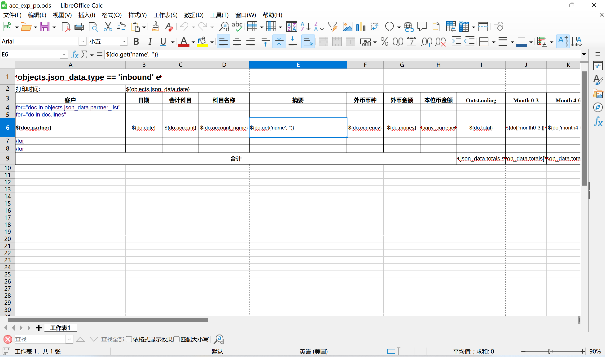

# Odoo打印excel报表（report_py3o）

## 配置

### 下载

下载wkhtmltopdf：[wkhtmltopdf](https://wkhtmltopdf.org/)

下载report_py3o：[Py3o Report Engine | The Odoo Community Association | OCA (odoo-community.org)](https://odoo-community.org/shop/py3o-report-engine-4104#attr=6451)

gitee链接：[OCA/report_py3o · LC_Link/document - 码云 - 开源中国 (gitee.com)](https://gitee.com/LC_Link/document/tree/master/OCA/report_py3o)

下载LibreOffice：[下载 LibreOffice | LibreOffice 简体中文官方网站 - 自由免费的办公套件](https://zh-cn.libreoffice.org/download/libreoffice/)

### 环境

- py3o.template  

- py3o.formats

- openpyxl 

- pandas 

- pysmb

### 在Odoo的config文件引入相关配置

```config
[options]
bin_path = D:\Odoo\odoo-soft\odoo-path\wkhtmltopdf\bin
py3o_server_path = D:\Odoo\odoo-sotf\odoo-path\LibreOffice\program\soffice.exe
py3o_server_port = 2002
```

## 使用

学习链接：[odoo13-addon-report-py3o - 基于Libreoffice的报表引擎（ODT -> ODT、ODT -> PDF、ODT -> DOC、ODT -> DOCX、ODS -> ODS等）_PyPI中文网](https://pypi.com.cn/project/odoo13-addon-report-py3o/)

### 使用LibreOffice编辑ods文件

具体使用：[Templating with LibreOffice — py3o.template 0.9.10 documentation (py3otemplate.readthedocs.io)](https://py3otemplate.readthedocs.io/en/latest/templating.html?highlight=html)



### 打印动作视图

```xml
<record id="account_payment_py3o_report" model="ir.actions.report">
    <field name="name">预收/付账龄</field>
    <field name="report_type">py3o</field>
    <field name="type">ir.actions.report</field>
    <field name="model">account.payment.json.wizard</field>
    <field name="report_name">acc_po_py_py3o_exporte</field>
    <field name="report_type">py3o</field>
    <field name="module">nst_account_receivable</field>
    <field name="py3o_filetype">xls</field>
    <field name="py3o_template_fallback">report_action/exp_po/acc_exp_po.ods</field>
    <field name="binding_model_id" ref="nst_account_receivable.model_account_payment_json_wizard"/>
</record>
```

### 处理数据方法

- 常规打印模型

```python
def action_print(self):
    return self.env.ref('my_test_module.action_account_entry_invoices').report_action(self)
```

- 打印处理过的数据(json) 

```python
#瞬态模型存储json数据
from odoo import models, fields

class AccountPaymentJsonWizard(models.TransientModel):
    _name = 'account.payment.json.wizard'
    _description = 'Account Payment Json Wizard'

    json_data = fields.Json('json_data', default={})
```

```python
#在方法处理数据，使用瞬态模型执行打印
@api.model
def action_print(self, report_data):
    partners_data = {
        'date': datetime.now().strftime('%Y-%m-%d'),
        'partner_list': [
            {**value, 'id': key}
            for key, value in report_data['data'].items()
            if key != 'total'
        ],
        'totals': report_data['data'].get('total', {}),
        'type' : report_data['type']
    }
    wizard = self.env['account.payment.json.wizard'].create({
        'json_data': partners_data,
    })
    return wizard.env.ref('nst_account_receivable.account_payment_py3o_report').report_action(wizard)
```

### 按钮调用方法

- 模型按钮调用

```xml
<button name="action_print" string="打印" type="object" class="oe_highlight" icon="fa-download"/>
```

- 自定义按钮调用

```xml
<button type="button" class="btn btn-secondary ac_report_xlsx"
    style="position: relative;"  t-on-click="onExportExcel">
打印 (XLSX)
</button>
```

```js
this.action = useService("action")
this.notification = useService("notification")

async onExportExcel() {
    try {
        this.notification.add("导出Excel报表...", { type: 'info' });
        const reportData = {
            data: this.data,
            type: this.defaultPaymentType,
        };
        const action = await this.orm.call(
            'account.payment',
            'action_print',
            [reportData]
        );
        return this.action.doAction(action);
    } catch (error) {
        console.error("Excel导出失败:", error);
        this.notification.add("Excel导出失败: " + error.message, { type: 'danger' });
    }
} 
```
