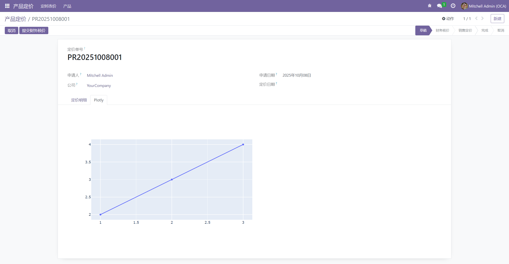

# 小部件

## Web Widget Plotly

> 通过Text字段存储图表信息，并生成Plotly Chart图表

官方链接：[Web 小部件 Plotly | Odoo 社区协会 |亚太 (odoo-community.org)](https://odoo-community.org/shop/web-widget-plotly-5069?page=33&category=26)

下载链接：[OCA/web_widget_plotly_chart · LC_Link/document - 码云 - 开源中国 (gitee.com)](https://gitee.com/LC_Link/document/tree/master/OCA/web_widget_plotly_chart)

Plotly链接：[GitHub - plotly/plotly.py: The interactive graphing library for Python :sparkles:](https://github.com/plotly/plotly.py#overview)

**步骤**

- 写一个Text计算字段

```python
plotly_chart = fields.Text(
    string='Plotly Chart',
    compute='_compute_plotly_chart',
) 
```

- 写计算字段方法  

```python
def _compute_plotly_chart(self):
    for rec in self:
        data = [{'x': [1, 2, 3], 'y': [2, 3, 4]}]
        rec.plotly_chart = plotly.offline.plot(data,
                                               include_plotlyjs=False,
                                               output_type='div')
```

- 在视图使用

```xml
<field name="plotly_chart" widget="plotly_chart" nolabel="1"/>
```

**效果**


