# Hive

> hive是基于Hadoop的一个数据仓库工具，用来进行数据提取、转化、加载，这是一种可以存储、查询和分析存储在Hadoop中的大规模数据的机制。hive数据仓库工具能将结构化的数据文件映射为一张数据库表，并提供SQL查询功能，能将SQL语句转变成MapReduce任务来执行。Hive的优点是学习成本低，可以通过类似SQL语句实现快速MapReduce统计，使MapReduce变得更加简单，而不必开发专门的MapReduce应用程序。hive十分适合对数据仓库进行统计分析。

### hadoop文件操作

##### 在LG04中启动dfs 在LG06中启动yarm

```
/opt/apps/hadoop-2.7.2/sbin/start-dfs.sh
/opt/apps/hadoop-2.7.2/sbin/start-yarn.sh
```

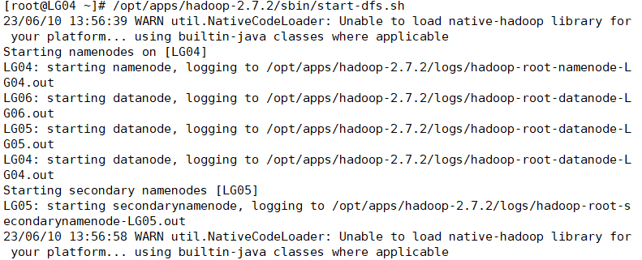

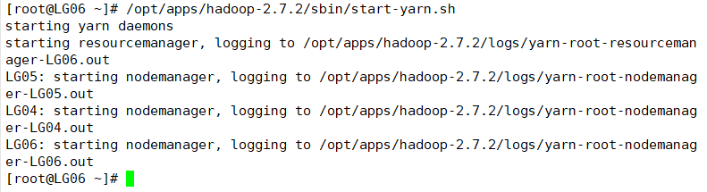

##### 在bin中创建文件夹test

```
./hdfs dfs -mkdir /test
```

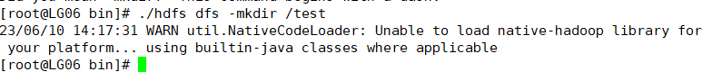

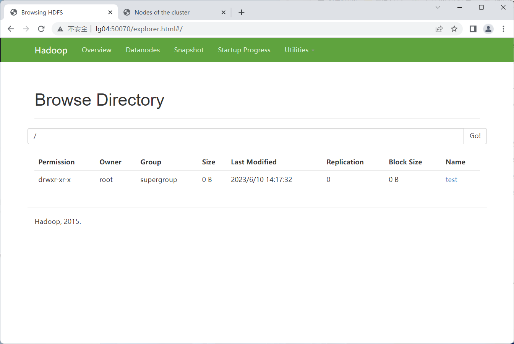

##### 在bin中上传文件

```
./hdfs dfs -put /opt/apps/data.txt /test

//其中的-put将put换成linux文件指令就可操作文件
```

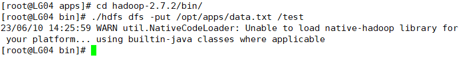

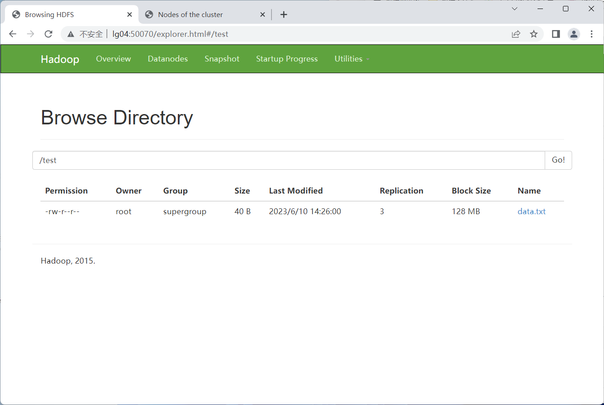

### 安装hive

##### 将hive安装包放入/opt/soft

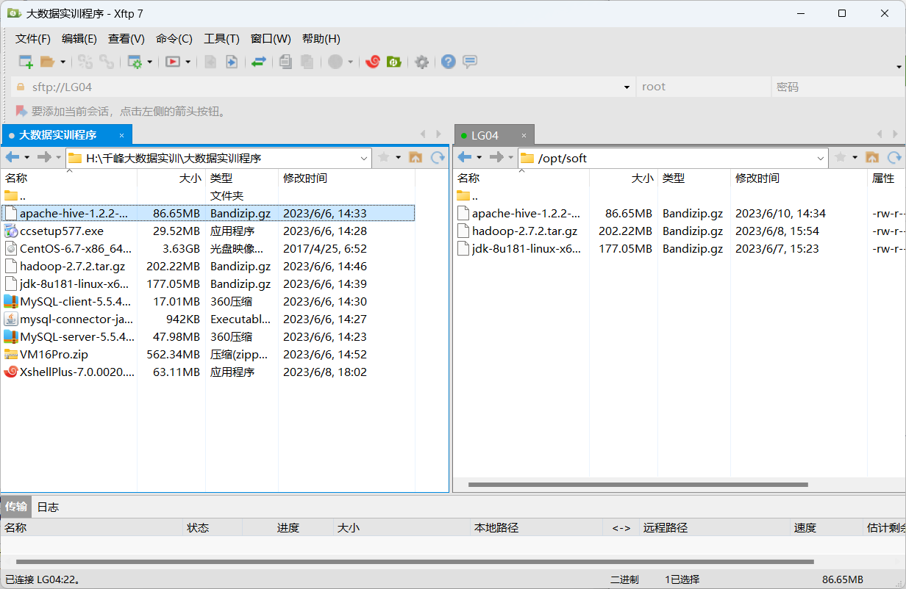

##### 解压到/opt/apps

```
tar -zxvf ./apache-hive-1.2.2-bin.tar.gz -C /opt/apps/
```

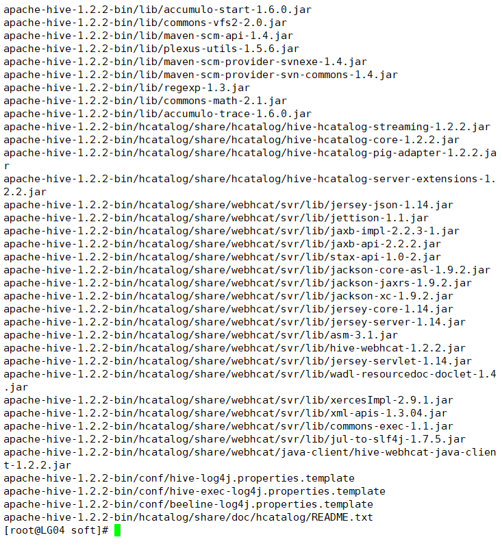

##### 到解压的文件目录下

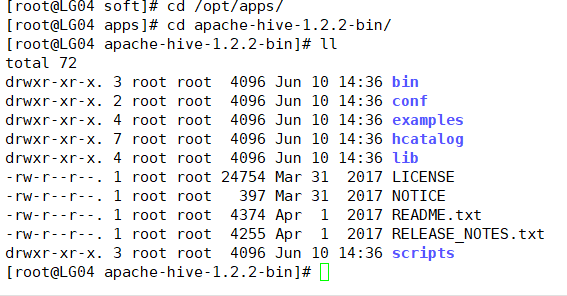

### 安装Mysql

##### 找出rpm中原来的mysql包并卸载

```
rpm -qa|grep mysql

rpm -e --nodeps mysql-libs-5.1.73-5.el6_6.x86_64
```

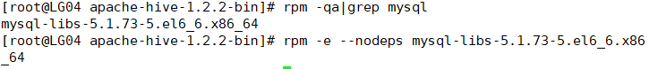

##### 将MySQL的客户端、服务端、驱动放入/opt/soft/中并安装

> 先安装服务端，在安装客户端，最后启动
>
> mysql只启动这一次，以后不用再重启

```
rpm -ivh ./MySQL-server-5.5.47-1.linux2.6.x86_64.rpm
rpm -ivh ./MySQL-client-5.5.47-1.linux2.6.x86_64.rpm
service mysql start
```

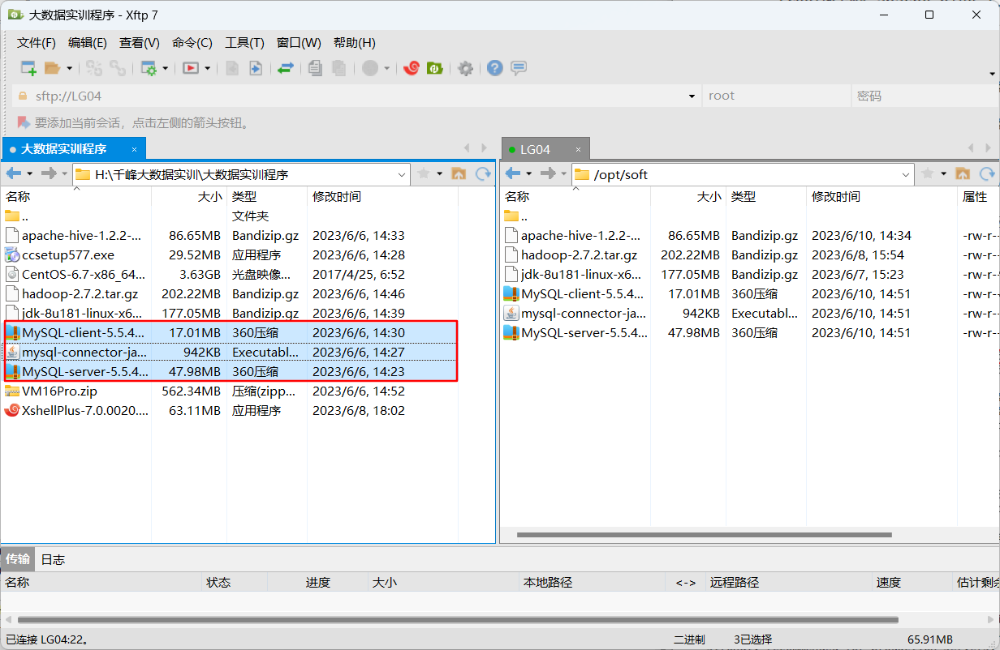

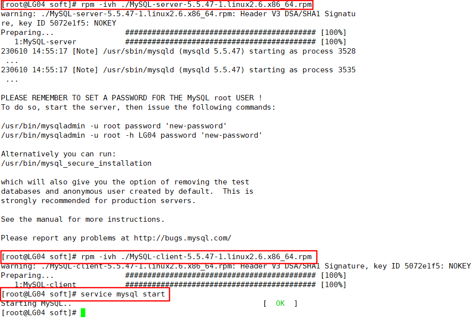

##### 进入mysql

```
mysql
```

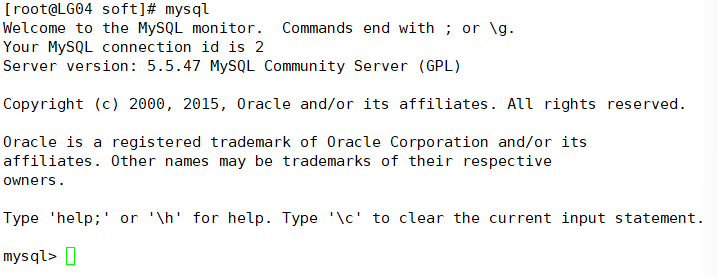

```
show databases;
use test;
show tables;
```

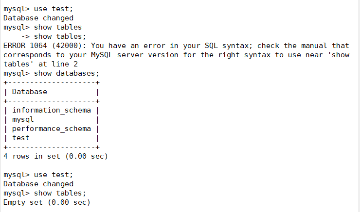

##### 设置mysql密码

```
mysqladmin -u root password "root"
mysql -uroot -proot
```

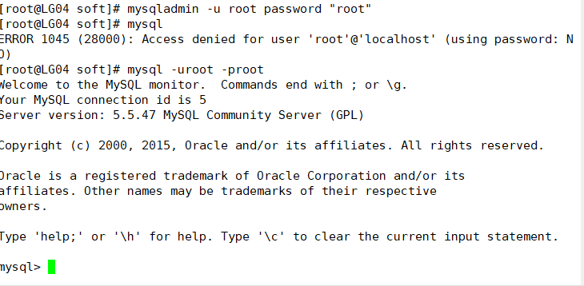

##### 使用mysql数据库中的user表

```
show databases;
use mysql;
show tables;
```

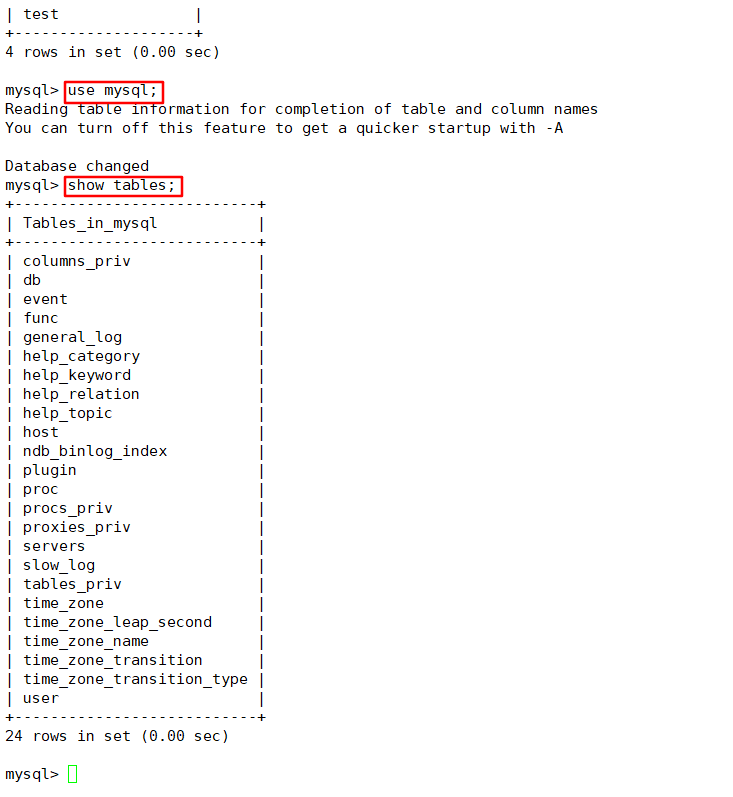

##### 查询user表中的host、user、password数据

> mysql用户登录的密码

```
select host,user,password from user;
```

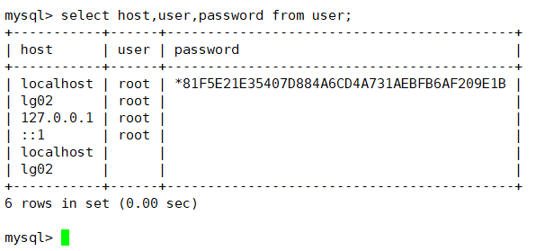

##### 修改host为LG02的password值为localhost的password值

> 让root用户登录LG02

```
update user set password="*81F5E21E35407D884A6CD4A731AEBFB6AF209E1B" where host="lg02" and user="root";
```

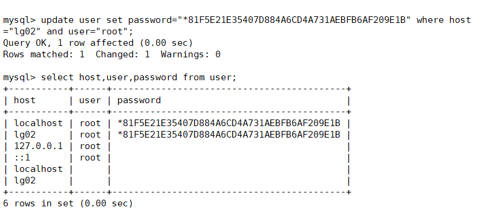

##### 刷新所有的权限

> 无论什么主机都能使用密码登录mysql

```
grant all privileges on *.* to 'root'@'%' identified by 'root';
flush privileges;
```

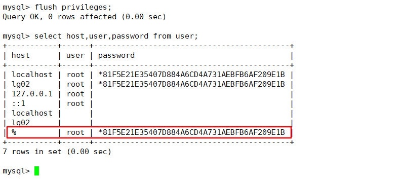


```
cp /usr/share/mysql/my-medium.cnf /etc/my.cnf
vim /etc/my.cnf
character_set_server = utf8
```

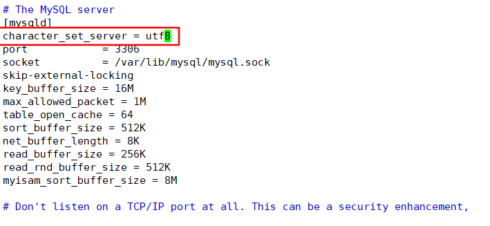

```
service mysql restart
```

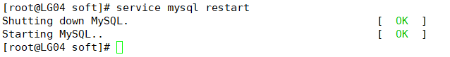

##### 在Navicat中链接LG04中的mysql

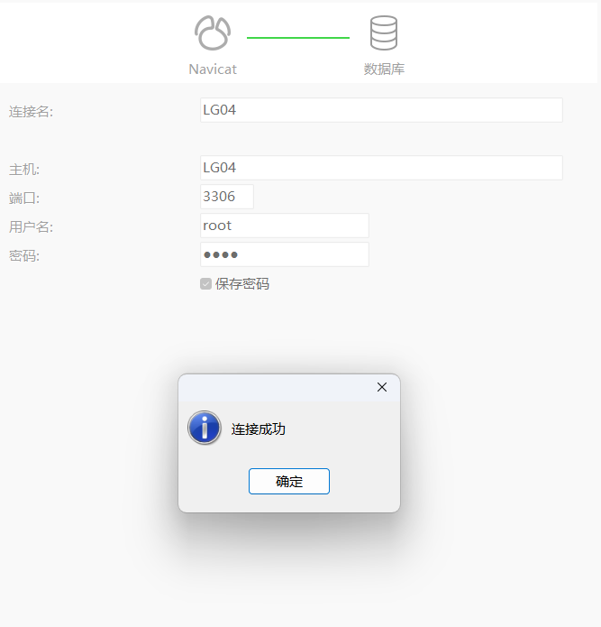

### 配置Hive

##### 进入/opt/apps/apache-hive-1.2.2-bin/conf目录下

```
cd /opt/apps/apache-hive-1.2.2-bin/conf
```

##### 将hive-env.sh.template重命名为hive-env.sh并编辑

```
mv ./hive-env.sh.template ./hive-env.sh
vim hive-env.sh
```

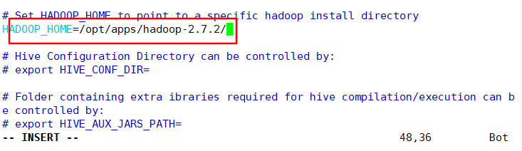

##### 进入 vim hive-default.xml.template复制头标签

```
 vim hive-default.xml.template
 
<?xml version="1.0" encoding="UTF-8" standalone="no"?>
<?xml-stylesheet type="text/xsl" href="configuration.xsl"?>
```

##### 创建hive-site.xml文件

```
vim hive-site.xml
将头文件复制在hive-site.xml文件中
```

```
<?xml version="1.0" encoding="UTF-8" standalone="no"?>
<?xml-stylesheet type="text/xsl" href="configuration.xsl"?>

<configuration>
<property>
        <name>hive.metastore.uris</name>
        <value>thrift://LG04:9083</value>
</property>
<property>
        <name>hive.metastore.warehouse.dir</name>
        <value>/user/hive/warehouse</value>
</property>
<property>
        <name>hive.metastore.schema.verification</name>
        <value>false</value>
</property>
<property>
        <name>javax.jdo.option.ConnectionURL</name>
        <value>jdbc:mysql://LG04:3306/hive?createDatabaseIfNotExist=true&amp;useUnicode=true&amp;characterEncoding=UTF-8</value>
</property>
<property>
        <name>javax.jdo.option.ConnectionDriverName</name>
        <value>com.mysql.jdbc.Driver</value>
</property>
<property>
        <name>javax.jdo.option.ConnectionUserName</name>
        <value>root</value>
</property>
<property>
        <name>javax.jdo.option.ConnectionPassword</name>
        <value>root</value>
</property>
<property>
        <name>hive.cli.print.current.db</name>
        <value>true</value>
</property>
<property>
        <name>hive.cli.print.header</name>
        <value>true</value>
</property>
</configuration>
```

##### 进入/opt/apps/apache-hive-1.2.2-bin/lib目录，并将驱动复制到该目录下

```
cd /opt/apps/apache-hive-1.2.2-bin/lib
cp /opt/soft/mysql-connector-java-5.1.31.jar ./
```

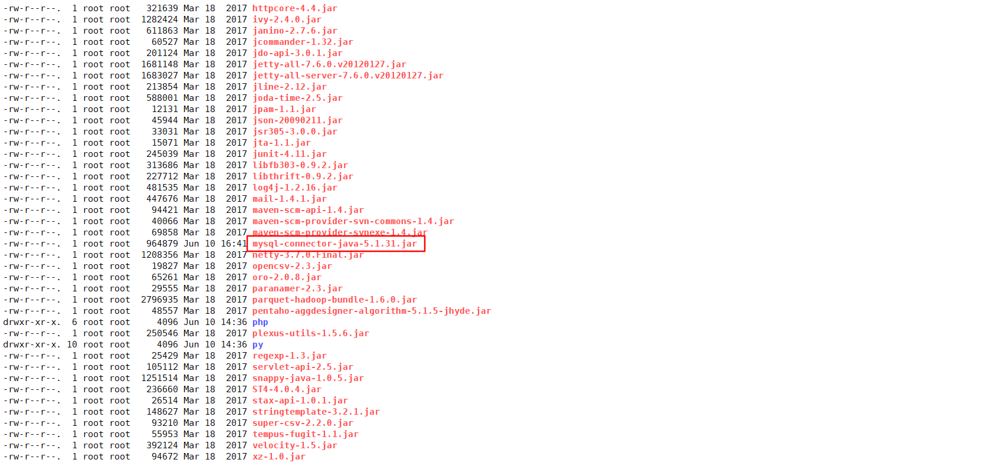

##### 去/opt/apps/apache-hive-1.2.2-bin/bin目录下执行./schematool -dbType mysql -initSchema

```
cd /opt/apps/apache-hive-1.2.2-bin/bin
./schematool -dbType mysql -initSchema
```

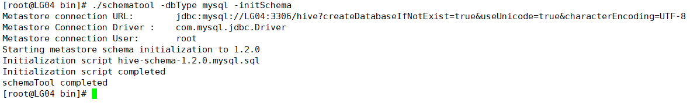

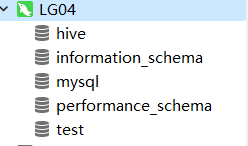

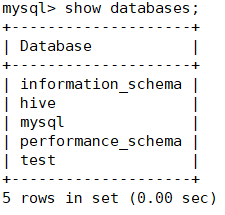
