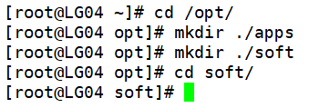
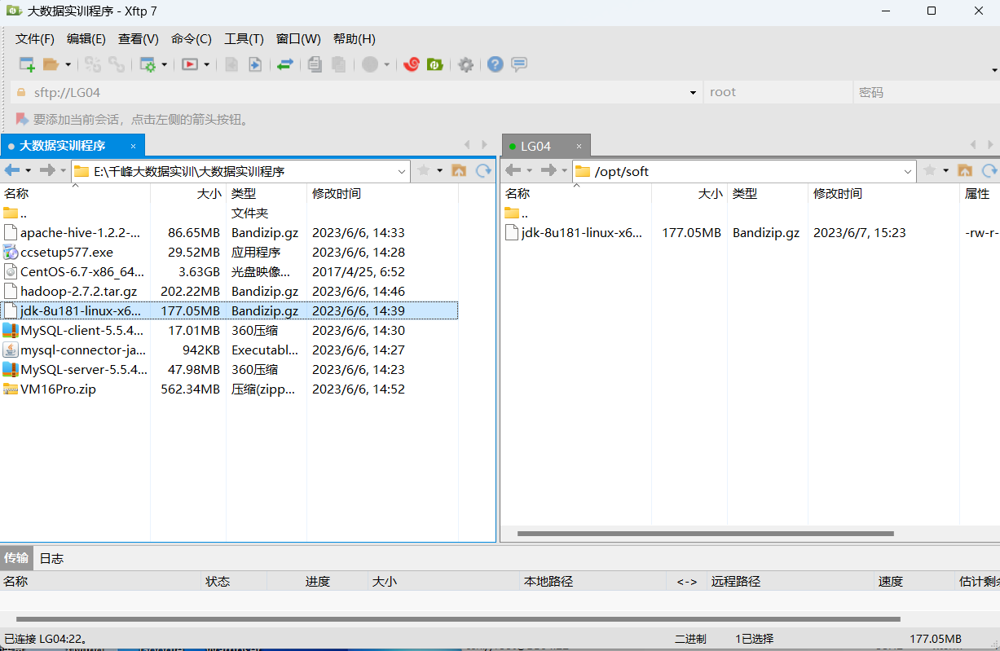
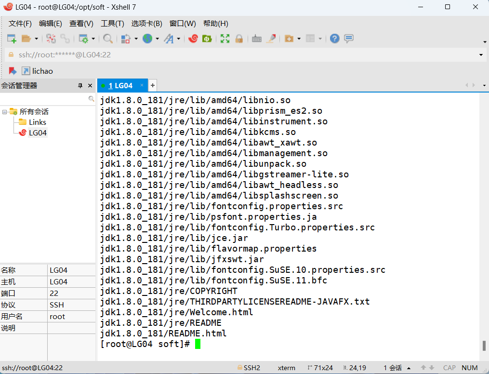
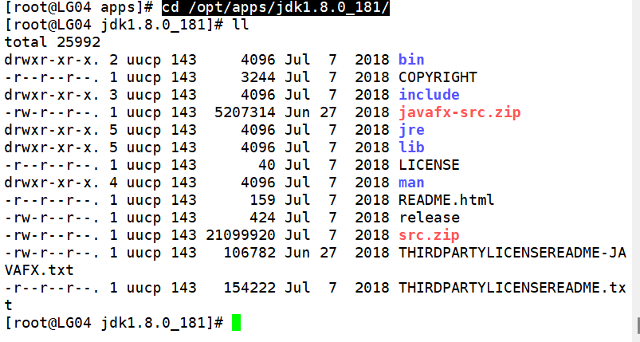
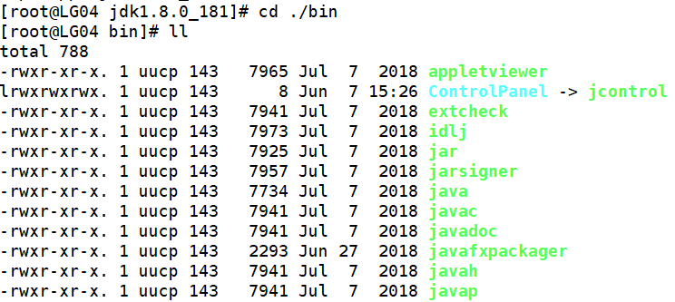
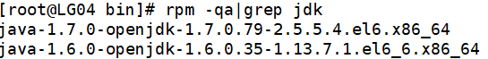
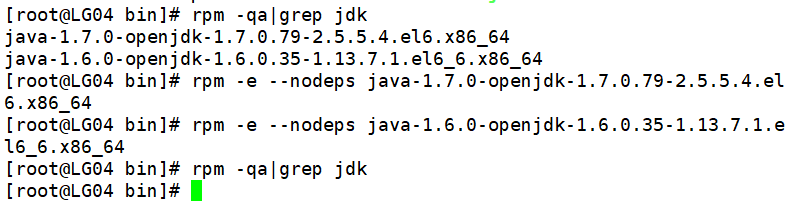
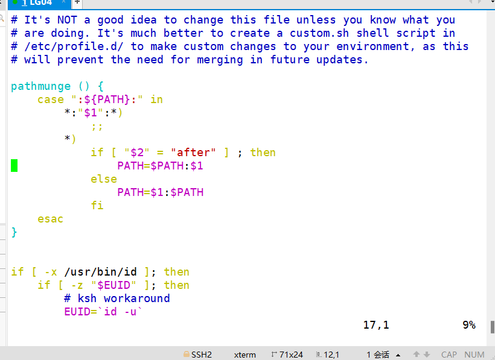
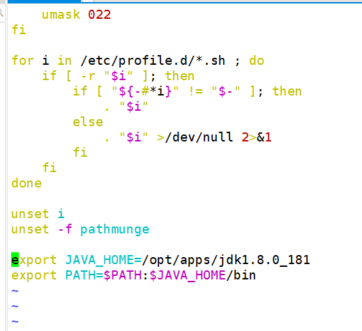
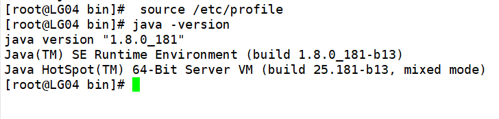

# 配置Java环境


## 安装JDK

##### 在/opt下创建两个目录

```
cd /opt/
mkdir ./apps
mkdir ./soft
cd soft
```

​	

##### 将jdk放入 /opt/soft目录中

##### 解压到apps

```
tar -zxvf jdk-8u181-linux-x64.tar.gz -C /opt/apps/
```



##### 进入opt下的jdk

```
cd /opt/apps/jdk1.8.0_181/
```

​	

##### 进入bin

```
cd ./bin
```

​	

> drwxrwxrwx	第一位表示文件类型 ，2~4表示管理员权限，5~7表示组员权限，8~10表示所属者权限	r:读	w:改	x:执行

##### 查找需要卸载的jdk

```
rpm -qa|grep jdk
```

​	

##### 卸载

```
rpm -e --nodeps java-1.7.0-openjdk-1.7.0.79-2.5.5.4.el6.x86_64
rpm -e --nodeps java-1.6.0-openjdk-1.6.0.35-1.13.7.1.el6_6.x86_64
```

​	

## 配置环境变量

##### 编辑profile文件

```
vim /etc/profile
```

​	

##### 在最下方添加以下内容

```
export JAVA_HOME=/opt/apps/jdk1.8.0_181
export PATH=$PATH:$JAVA_HOME/bin
```

​	

##### 刷新profile文件

```
source /etc/profile
```



