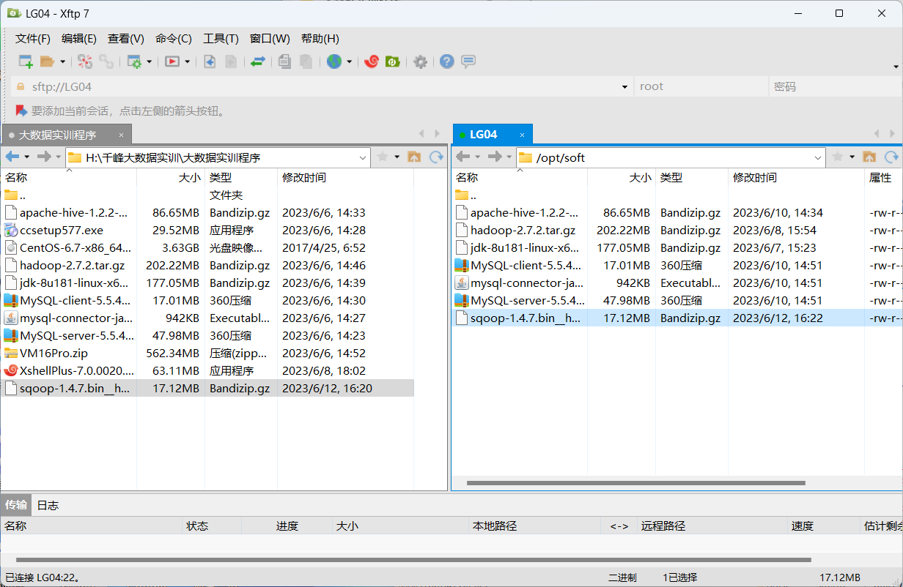
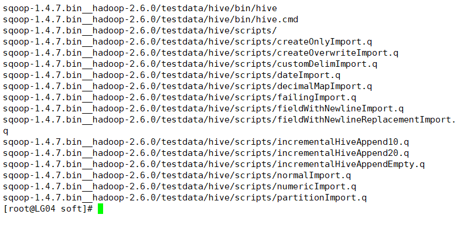
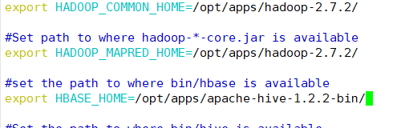
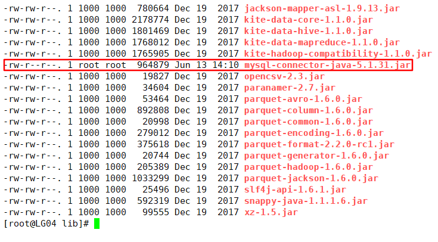
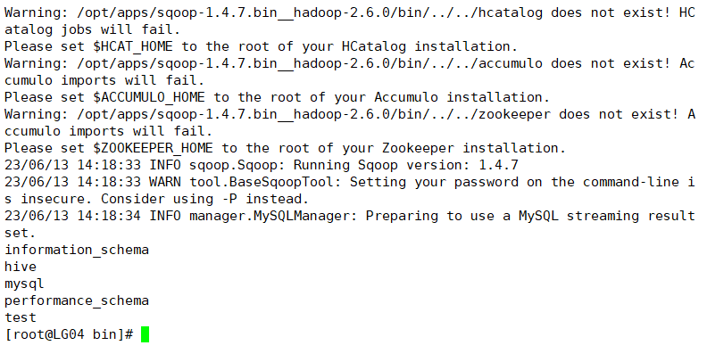

# sqoop安装

> Sqoop(发音：skup)是一款开源的工具，主要用于在Hadoop(Hive)与传统的数据库(mysql、postgresql...)间进行数据的传递，可以将一个关系型数据库（例如 ： MySQL ,Oracle ,Postgres等）中的数据导进到Hadoop的HDFS中，也可以将HDFS的数据导进到关系型数据库中。Sqoop项目开始于2009年，最早是作为Hadoop的一个第三方模块存在，后来为了让使用者能够快速部署，也为了让开发人员能够更快速的迭代开发，Sqoop独立成为一个Apache项目。

##### 将sqoop放入/opt/soft目录中



##### 解压缩到/opt/apps目录中

```
tar -zxvf ./sqoop-1.4.7.bin__hadoop-2.6.0.tar.gz -C /opt/apps/
```



##### 进入/opt/apps/sqoop-1.4.7.bin__hadoop-2.6.0/conf/目录

```
cd /opt/apps/sqoop-1.4.7.bin__hadoop-2.6.0/conf/
```

##### 将 sqoop-env-template.sh修改为 sqoop-env.sh

```
mv  ./sqoop-env-template.sh ./sqoop-env.sh
```

##### 修改sqoop-env.sh文件

```
vim sqoop-env.sh
```



##### 将mysql的jar包拷贝到sqoop的lib目录下

```
cd /opt/apps/sqoop-1.4.7.bin__hadoop-2.6.0/
ll
```



##### 在sqoop的bin目录下执行以下操作

```
cd /opt/apps/sqoop-1.4.7.bin__hadoop-2.6.0/bin

./sqoop list-databases --connect jdbc:mysql://LG04:3306 --username root --password root
```

