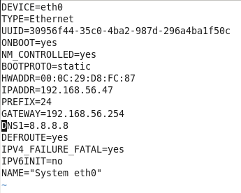
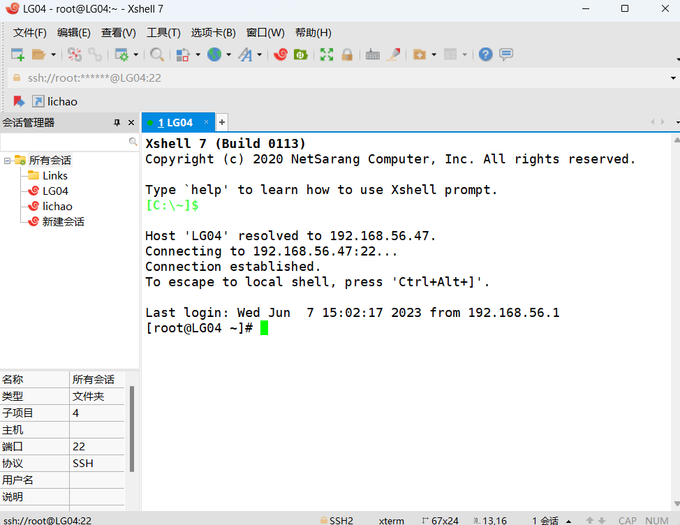

# 配置主机名并添加ip映射


## 修改主机名

```
vim /etc/sysconfig/network
```

​	


## 修改网卡设置

> ​	BOOTPROTO的值设为static
>

```
vim /etc/sysconfig/network-scripts/ifcfg-eth0
```

​	

##### 		修改完后重启网卡 

```
service network restart
```

​	


## 主机映射路径

##### 		windows下增加主机映射路径

​	C:\Windows\System32\drivers\etc\hosts文件


​	列如 192.168.56.47 LG04

​	

##### 		linux下增加主机映射路径

```
vim /etc/hosts
```

​	

##### 	在xshell中通过主机名链接主机

​	

