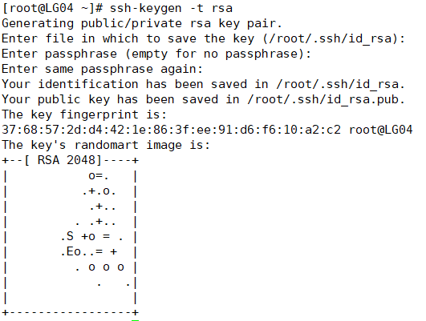
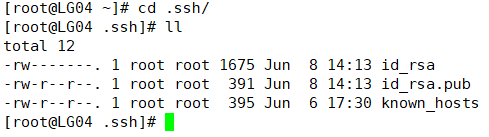
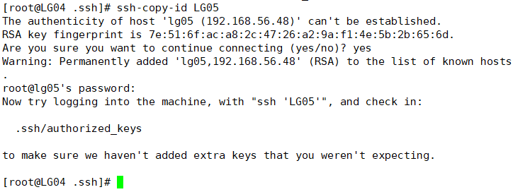
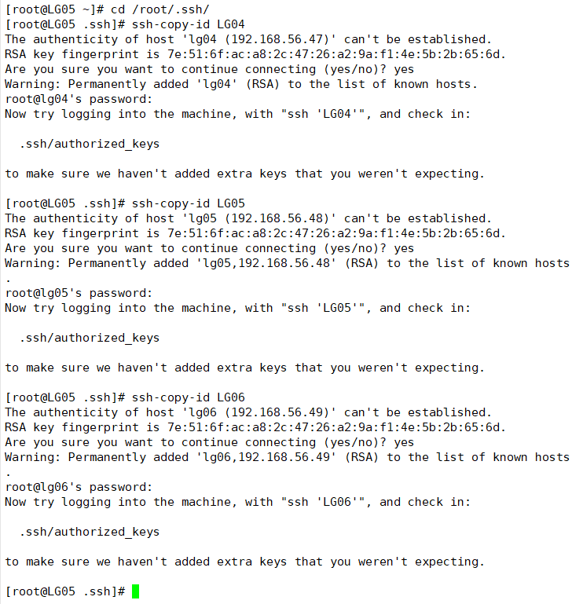
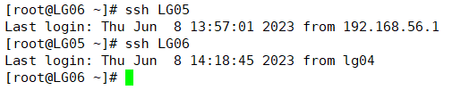

# 配置免密ssh

> 每个服务器都要执行以下操作

## 产生两把钥匙

> 一直按回车

```
ssh-keygen -t rsa
```



## 进入/root/下的.ssh

```
cd /root/.ssh/
```



## 将公密钥发给LG05、LG06、LG04(包括自己)

> 自己也要发送，可以不用密码来访问这三个服务器

```
ssh-copy-id LG05
```



## 每个服务器都要发送密钥（包括自己）



## 免密登录各个服务器

```
ssh LG04
ssh LG05
ssh LG06
```

