# hive的相关操作

> 在启动hive前要启动hadoop

```
/opt/apps/hadoop-2.7.2/sbin/start-dfs.sh
/opt/apps/hadoop-2.7.2/sbin/start-yarn.sh
```


##### 启动hive

> 进入cd /opt/apps/apache-hive-1.2.2-bin/bin/	执行./hive --service metastore&

```
cd /opt/apps/apache-hive-1.2.2-bin/bin/
./hive --service metastore&
```


```
./hive
```


##### 创建并使用数据库

```
create database lc;
use lc;
```


##### 创建student表

```
create table student(id int,name string);
show tables;
```


##### 添加数据

```
insert into student values(1,"mike"),(2,"kobe"),(3,"james");
```


##### 查询表

```
select * from student;
```


##### 处理中文乱码

> ctrl C	//退出hive
>
> jps	//查询Runjar进程号
>
> kill -9 Runjar进程	//杀死Runjar进程

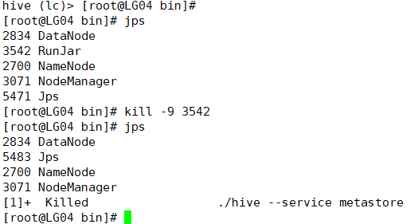

##### 进入mysql中的hive数据库

```
mysql -uroot -proot
show databases;
use hive;
```

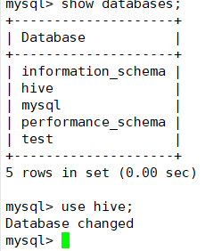

##### 依次输入执行以下sql语句

```
alter table COLUMNS_V2 modify column COMMENT varchar(256) character set 'utf8';
alter table TABLE_PARAMS modify column PARAM_VALUE varchar(4000) character set 'utf8';
```

```
alter table PARTITION_PARAMS modify column PARAM_VALUE varchar(4000) character set 'utf8';
alter table PARTITION_KEYS modify column PKEY_COMMENT varchar(4000) character set 'utf8';
```

```
alter table INDEX_PARAMS modify column PARAM_VALUE varchar(4000) character set 'utf8';
```

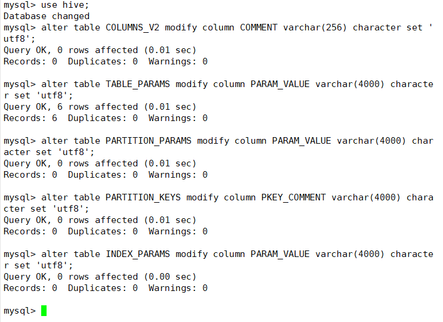

##### 退出mysql并重启mysql和hive

```
service mysql restart
./hive --service metastore&
```

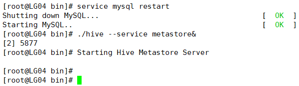

##### 再次进入hive

```
./hive
```

##### 建表

> 以','进行分割

```
create table man(id int,name string,age int,address string)row format delimited fields terminated by ',';
```

##### 插入数据

```
insert into man values(1,"LZX",48,"TW"),(2,"LYF",35,"SC"),(3,"WYF",32,"Canada"),(4,"LYD",40,"CQ");
```

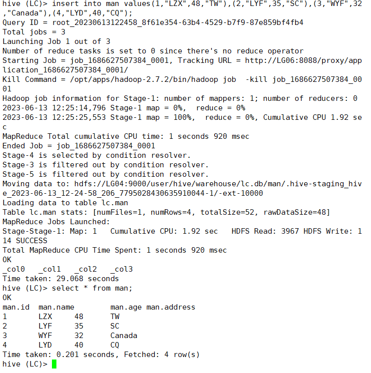

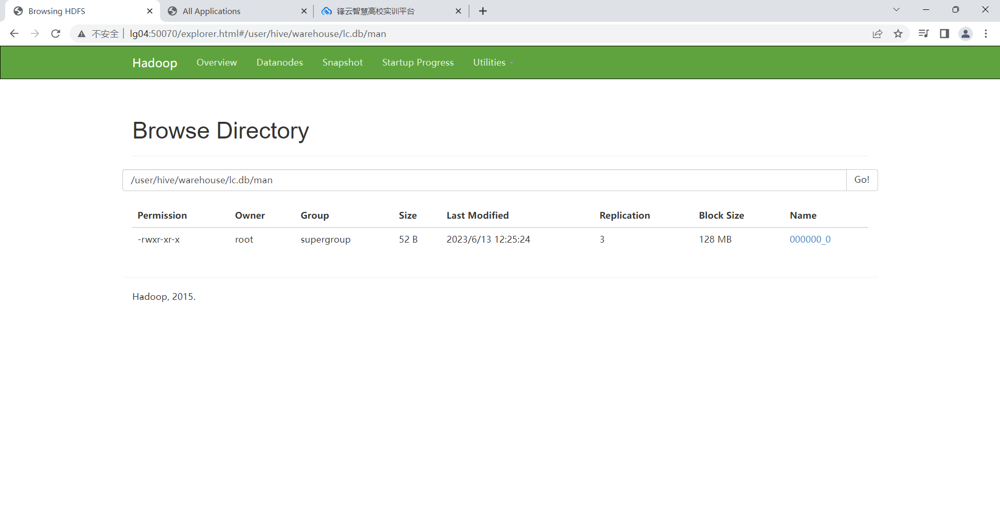

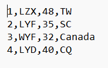

##### 传入car.txt文件，假设先有文件，再有数据表

> 该表的分隔符是“\t”

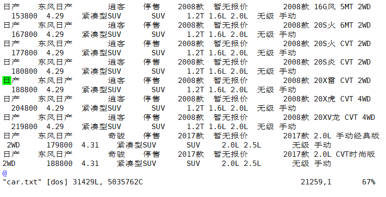

##### 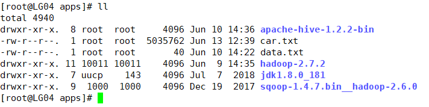

##### 对car.txt中的数据建表

> 品牌 Brand										(string)
> 下属品牌	Subordinate_brands	(string)
> 车系 Car_series								 (string)
> 在售情况	On_sale_situation		 (string)
> 参数配置	Configuration				(string)
> 经销商报价 Dealer_quotation 		(int)
> 型号 Model										(string)
> 指导价 Guide_price						  (int)
> 用户评分	User_rating					(float)
> 车型 Vehicle_model						  (string)
> 车身结构	Body_structure			  (string)
> 发动机 Engine									(string)
> 变速箱 Transmission						(string)

```
create table car(Brand string,Subordinate_brands string,Car_series string,On_sale_situation string,Configuration string,Dealer_quotation int,Model string,Guide_price int,User_rating float,Vehicle_model string,Body_structure string,Engine string,Transmission string)row format delimited fields terminated by '\t';
```

##### （了解）本地操作：将文件car.txt中的数据上传到car表中

```
load data local inpath "/opt/apps/car.txt" into table car;
```

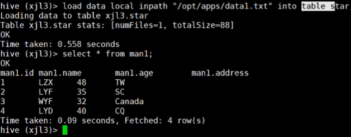

##### 将文件cai.txt上传到hadoop上再将数据上传到car表中

> 进入/opt/apps/hadoop-2.7.2/bin目录执行上传操作，上传到根目录

```
cd /opt/apps/hadoop-2.7.2/bin
./hdfs dfs -put /opt/apps/car.txt /
```

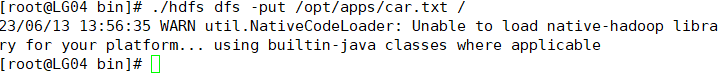

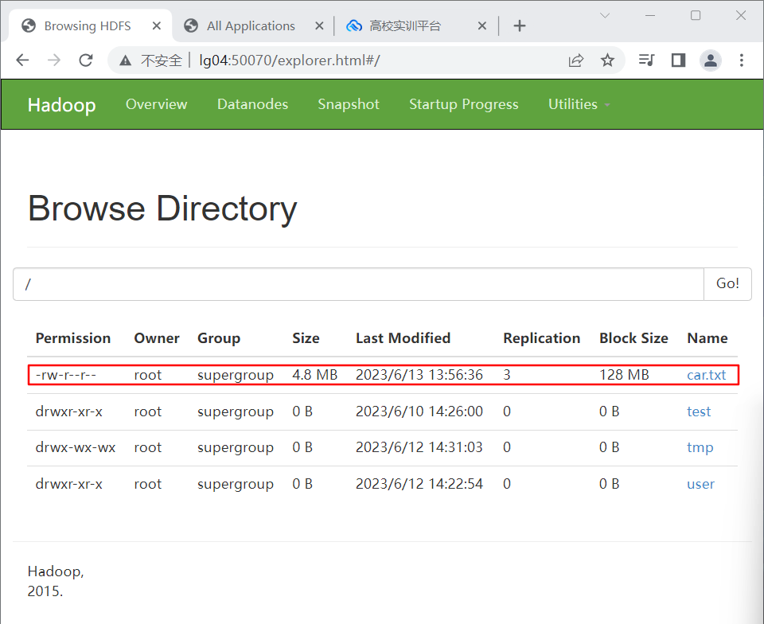

##### 上传数据到car表

> 与上传本地相比，删除local ，代表默认不是本地地址，而是hadoop地址

```
load data inpath "/car.txt" into table car;
select * from car;
```

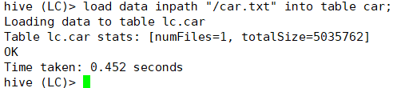

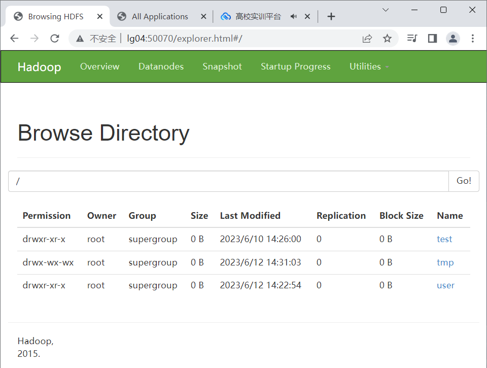

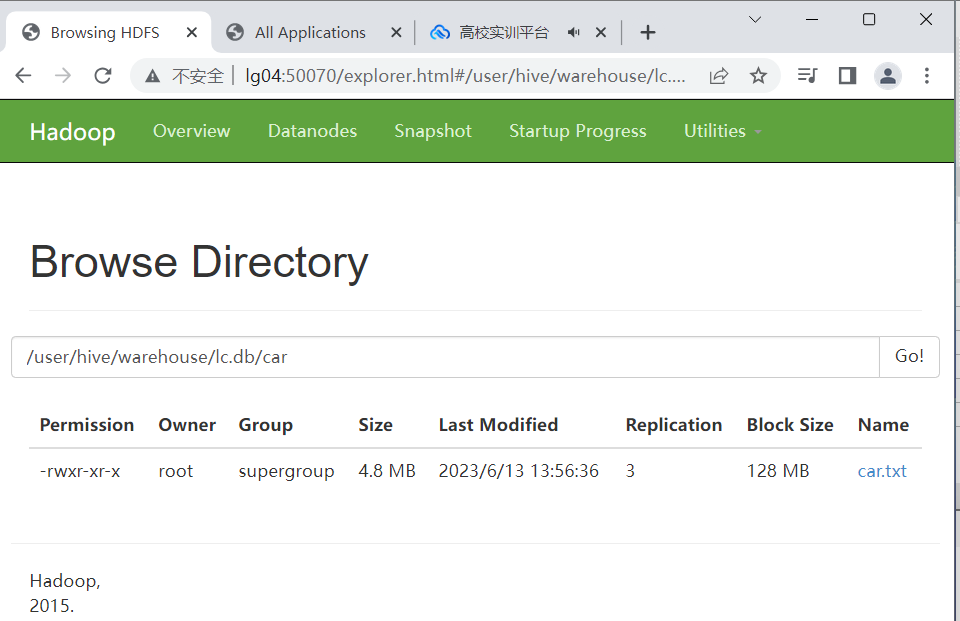

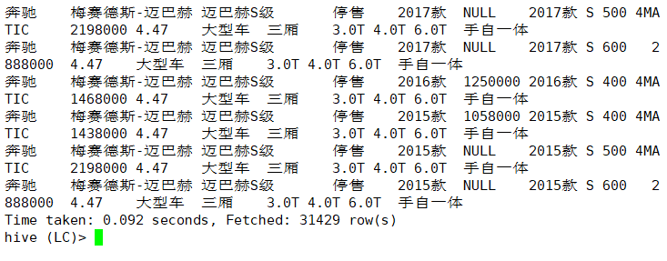

### hive的相关作业

##### 2，计算每个车辆品牌的数量分别是多少  （落地成新的表格 表名car_p_count 字段名(car_p --> 车辆品牌，car_count --> 车辆数量)）

```
create table car_p_count as select Brand as car_p,COUNT(*) as car_count from car group by Brand;
```

##### 3，计算车辆在售情况统计 （落地成新的表格 表名car_sell 字段名(car_sell_status --> 车辆在售状态，car_count --> 车辆数量)）（15分）

```
create table car_sell as select On_sale_situation as car_sell_status,COUNT(*) as car_count from car group by On_sale_situation;
```

##### 4，计算车辆各个品牌售价总和  （落地成新的表格 表名car_price 字段名(car_p --> 车辆品牌，car_total_price --> 车辆总价格)） （20分）

```
create table car_price as select Brand as car_p,sum(Dealer_quotation) as car_total_price from car group by Brand;
```

##### 5，计算车辆除去无评分状态下各个品牌评价总和排名[降序]   （落地成新的表格 表名car_f 字段名(car_p --> 车辆品牌，car_total_f --> 车辆总评分)）（20分）

```
create table car_f as select Brand as car_p,sum(User_rating) as car_total_f from car where User_rating is NOT NULL group by Brand order by car_total_f DESC;
```

##### 6，（附加）计算各种车型平均报价并排序[升序]    （落地成新的表格 表名car_xin 字段名(car_x --> 车辆车型，car_a_p --> 车辆平均报价)）（20分）

```
create table car_xin as select Vehicle_model as car_x,avg(Dealer_quotation) as car_a_p from car group by Vehicle_model order by car_a_p ASC;
```

