# Hadoop安装


### 安装

##### 访问hadoop官网中的文档

[Apache Hadoop 3.3.5 – Hadoop: Setting up a Single Node Cluster.](https://hadoop.apache.org/docs/stable/hadoop-project-dist/hadoop-common/SingleCluster.html)

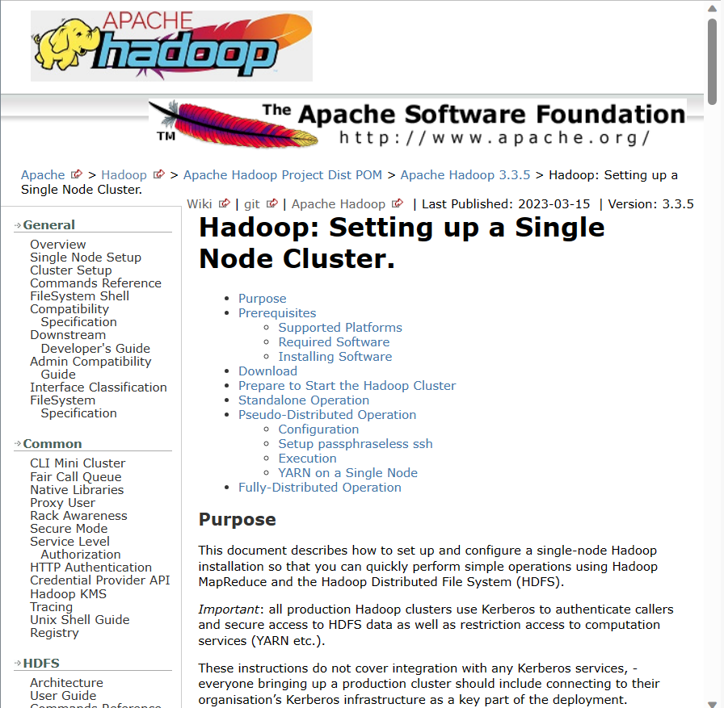

##### 到opt下的soft下，并放入hadoop

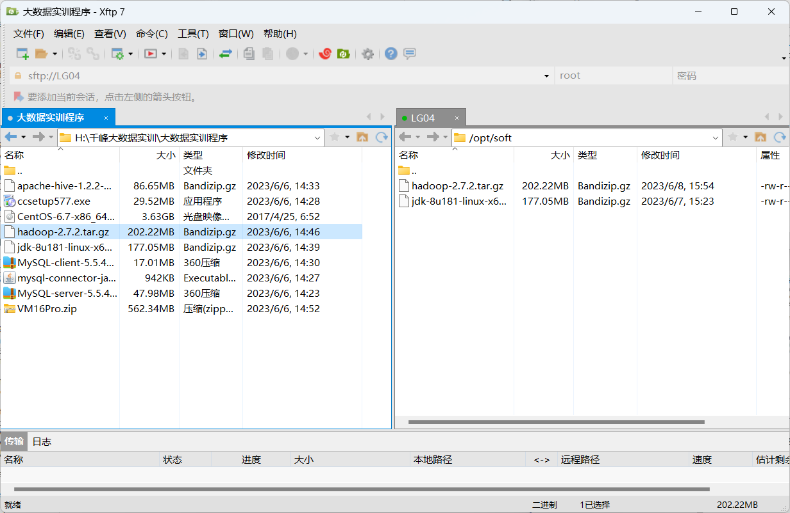

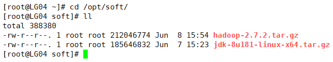

##### 解压到/opt/apps

```
tar -zxvf ./hadoop-2.7.2.tar.gz -C /opt/apps/
```

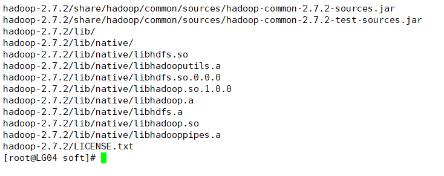

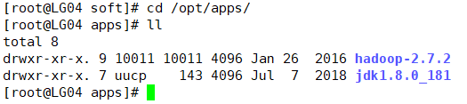

### 配置文件

##### 到/opt/apps/hadoop-2.7.2/etc/hadoop下编辑hadoop-env.sh

> 添加jdk地址 /opt/apps/jdk1.8.0_181/

```
vim /opt/apps/hadoop-2.7.2/etc/hadoop/hadoop-env.sh
```

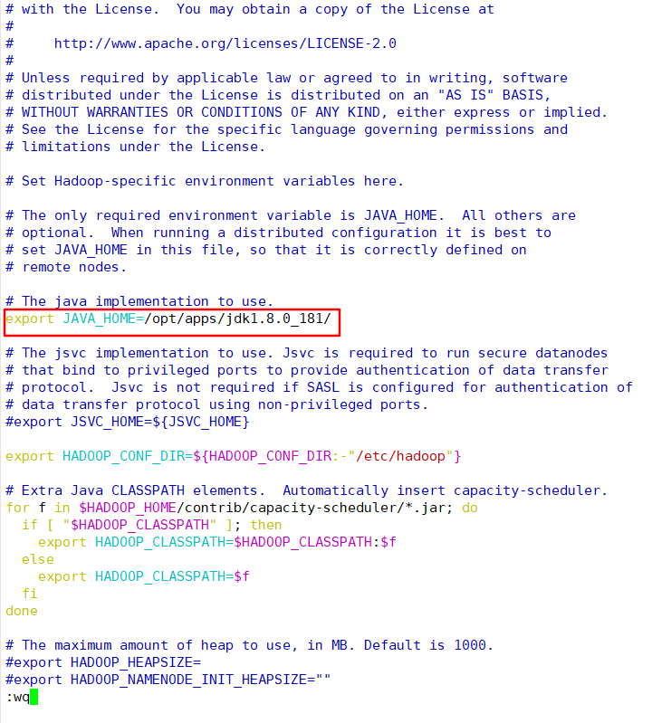

##### 编辑core-site.xml

> HDSF服务在LG04的9000端口上，hadoop.tmp.dir，临时文件夹的路径

```
vim core-site.xml

<property>
    <name>fs.defaultFS</name>
    <value>hdfs://LG04:9000</value>
</property>
<property>
    <name>hadoop.tmp.dir</name>
    <value>/opt/apps/hadoop-2.7.2/data/tmp</value>
</property>
```

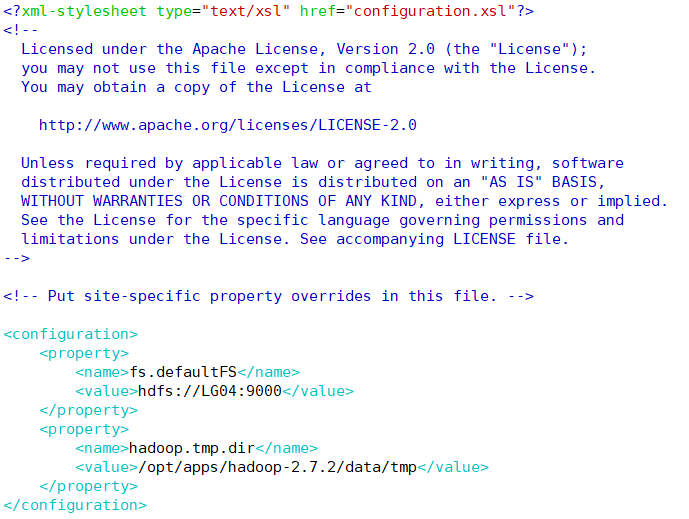

##### 编辑hdfs-site.xml

> dfs.replication的值设为3 ，代表3个副本，网页部署到LG05的50090端口上，

```
vim hdfs-site.xml

<property>
    <name>dfs.replication</name>
    <value>3</value>
</property>
<property>
    <name>dfs.namenode.secondary.http-address</name>
    <value>LG05:50090</value>
</property>
<property>
    <name>dfs.namenode.http-address</name>
    <value>LG04:50070</value>
</property>
<property>
    <name>dfs.permissions.enabled</name>
    <value>false</value>
</property>
```

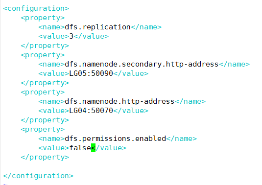

##### 改名并编辑mapred-site.xml

```
mv ./mapred-site.xml.template ./mapred-site.xml
vim ./mapred-site.xml

<property>
    <name>mapreduce.framework.name</name>
    <value>yarn</value>
</property>
```

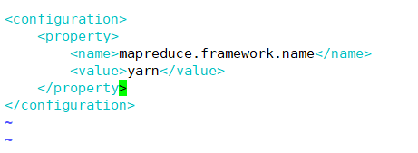

##### 修改yarn-site.xml

```
vim yarn-site.xml

<configuration>
<!-- Site specific YARN configuration properties -->
    <property>
        <name>yarn.nodemanager.aux-services</name>
        <value>mapreduce_shuffle</value>
    </property>
    <property>
        <name>yarn.resourcemanager.hostname</name>
        <value>LG06</value>
    </property>
    <property>
        <name>yarn.nodemanager.resource.memory-mb</name>
        <value>2048</value>
    </property>
    <property>
        <name>yarn.log-aggregation-enable</name>
        <value>true</value>
    </property>
    <property>
        <name>yarn.log-aggregation.retain-seconds</name>
        <value>604800</value>
    </property>
</configuration>
```

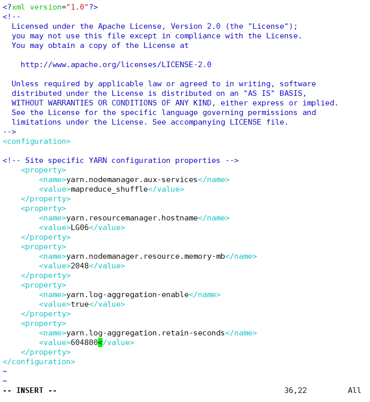

##### 修改slaves

```
vim slaves
```


##### 发送hadoop给LG05、LG06（在apps目录下）

```
scp -r ./hadoop-2.7.2/ LG05:/opt/apps/
scp -r ./hadoop-2.7.2/ LG06:/opt/apps/
```

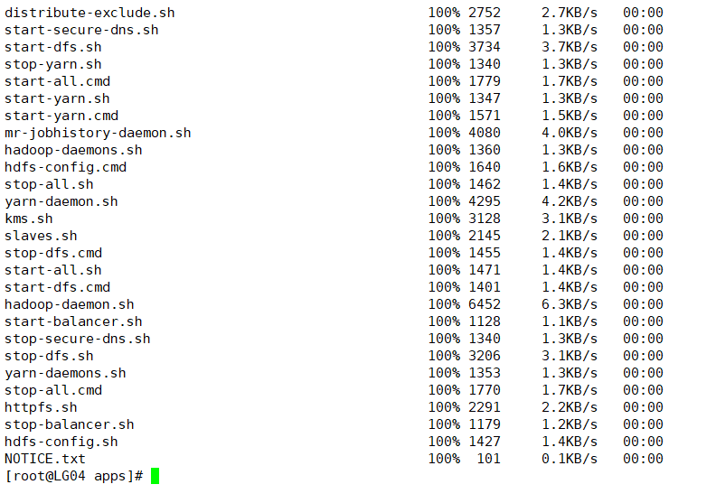

### 格式化

##### 关闭防火墙（三台都要）

```
service network status
service iptables status
```

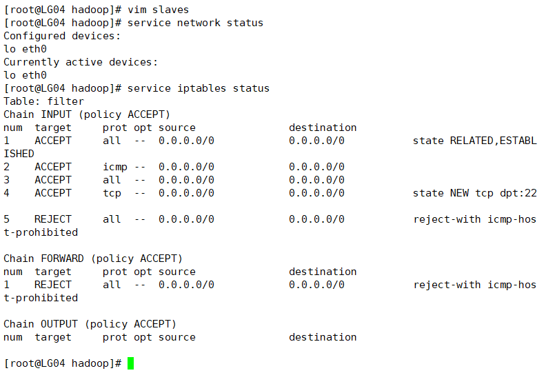

```
service iptables stop
```

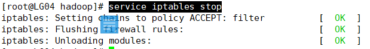

```
chkconfig iptables off //关机后也保持防火墙关闭
```

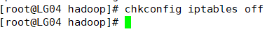

##### 到/opt/apps/hadoop-2.7.2/bin目录下格式化

```
./hdfs namenode -format
```

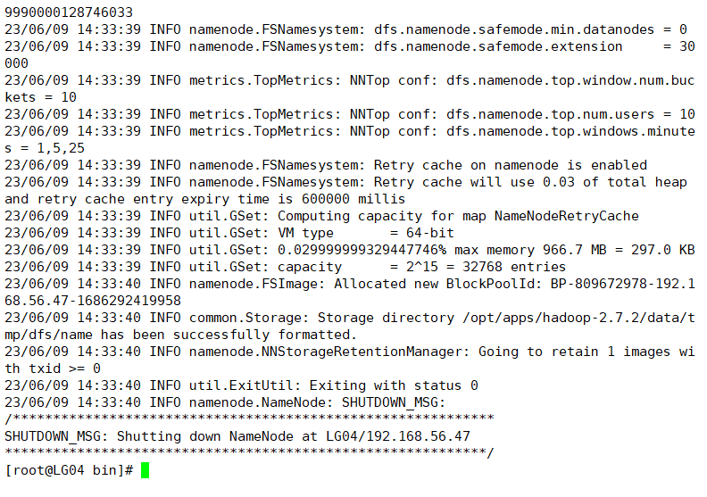

##### 启动/opt/apps/hadoop-2.7.2/sbin/start-dfs.sh

```
/opt/apps/hadoop-2.7.2/sbin/start-dfs.sh
jps
```

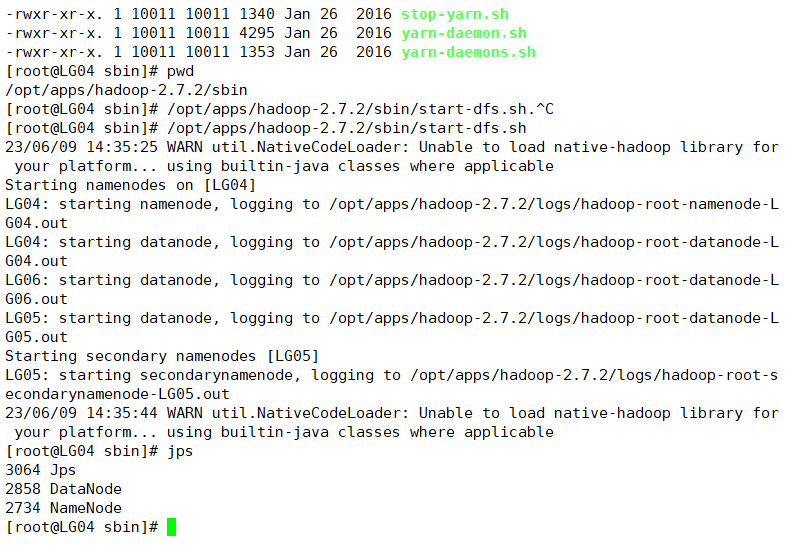

##### 在LG05

```
jps
```

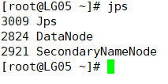

##### 在LG06    /opt/apps/hadoop-2.7.2/sbin/目录下执行./start-yarn.sh

```
/opt/apps/hadoop-2.7.2/sbin/start-yarn.sh
```

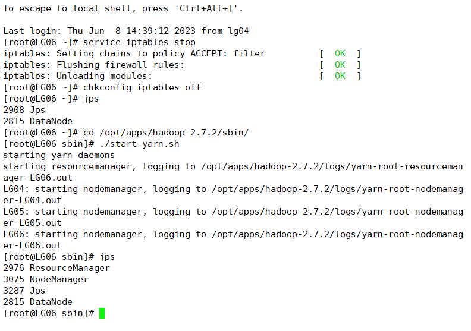

##### 返回LG05

```
jps
```

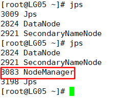

