# sqoop的操作

## sqoop的导入

### 创建数据库（无主键，一个map）

##### 进入MySQL的test数据库

```
mysql -uroot -proot
show databases;
use test;
show tables;
```

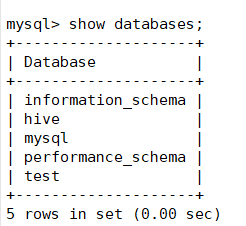

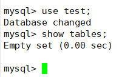

##### 创建表

```
create table nba(id int(4),name varchar(20),num int(4),team varchar(20));
```

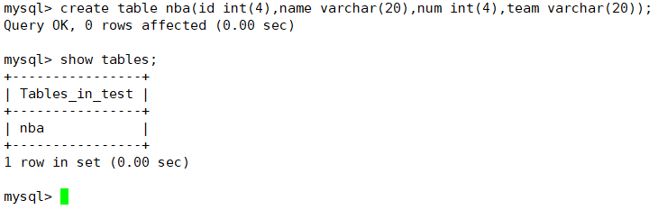

##### 插入数据

```
insert into nba values(1,"科比",42,"湖人"),(2,"詹姆斯",37,"湖人"),(3,"库里",32,"勇士"),(4,"哈登",32,"火箭");
```

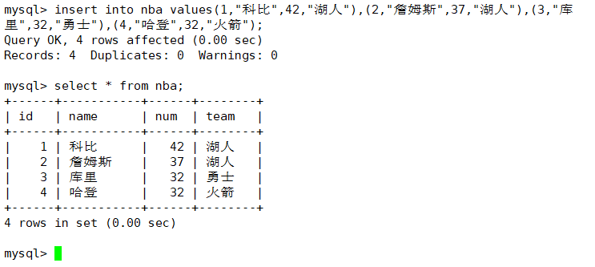

### 使用sqoop导入hdf（无主键，一个map）

##### 到/opt/apps/sqoop-1.4.7.bin__hadoop-2.6.0/bin目录下

```
cd /opt/apps/sqoop-1.4.7.bin__hadoop-2.6.0/bin
```

##### 执行导入

> 因为nba表中无主键 m不能>1

```
./sqoop import \
> --connect jdbc:mysql://LG04:3306/test \
> --username root \
> --password root \
> --table nba \
> --target-dir /data/to_hdfs \
> --m 1
```

```
./sqoop import --connect jdbc:mysql://LG04:3306/test --username root --password root --table nba --target-dir /data/to_hdfs --m 1
```

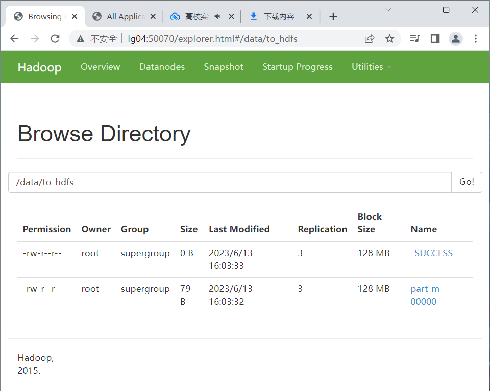

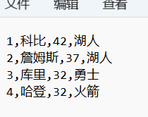

### 创建数据库（有主键，多个map）

##### 创建表

```
create table nba_key(id int(4) primary key,name varchar(20),num int(4),team varchar(20));
```

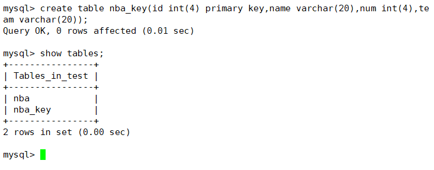

##### 插入数据

```
insert into nba_key values(1,"科比",42,"湖人"),(2,"詹姆斯",37,"湖人"),(3,"库里",32,"勇士"),(4,"哈登",32,"火箭");
```

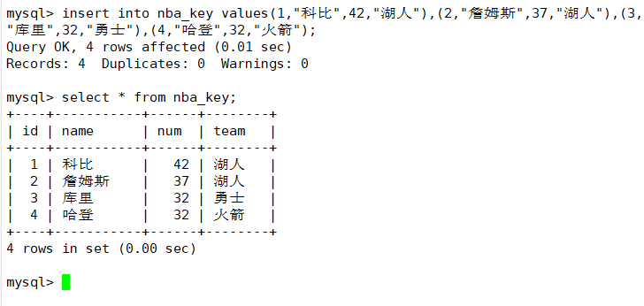

### 使用sqoop导入hdf（有主键，多个map）

##### 到/opt/apps/sqoop-1.4.7.bin__hadoop-2.6.0/bin目录下

```
cd /opt/apps/sqoop-1.4.7.bin__hadoop-2.6.0/bin
```

##### 执行导入

> map可以为多个,结果会有多个part文件拆分数据

```
./sqoop import \
> --connect jdbc:mysql://LG04:3306/test \
> --username root \
> --password root \
> --table nba_key \
> --target-dir /data/to_hdfs_nba_key \
> --m 4
```

```
./sqoop import --connect jdbc:mysql://LG04:3306/test --username root --password root  --table nba_key --target-dir /data/to_hdfs_nba_key --m 4
```


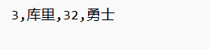

## sqoop的导出

##### 建一张空表

> 用于接收导出的数据

```
create table nba_result(id int(4) primary key,name varchar(20),num int(4),team varchar(20));
```

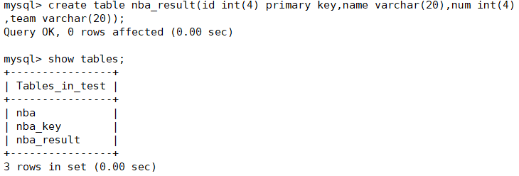

##### 进入/opt/apps/sqoop-1.4.7.bin__hadoop-2.6.0/bin目录下

```
cd /opt/apps/sqoop-1.4.7.bin__hadoop-2.6.0/bin
```

##### 执行导出

> 没有必要指定m，有几个文件，就指定几个map

```
./sqoop export \
> --connect jdbc:mysql://LG04:3306/test \
> --username root \
> --password root \
> --table nba_result \
> --export-dir /data/to_hdfs_nba_key \
> --fields-terminated-by ',' \
> --lines-terminated-by '\n'
```

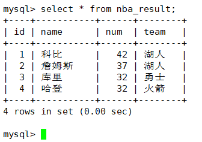

## 增量导入

> 必须要在有主键中的表中实现

##### 在nba_key表中再添加4条数据

```
insert into nba_key values(5,"杜兰特",31,"篮网"),(6,"欧文",30,"独行侠"),(7,"东七七",26,"独行侠"),(8,"易建联",36,"宏远");
```

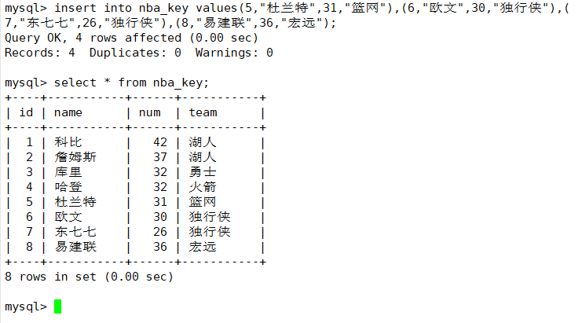

##### 进入/opt/apps/sqoop-1.4.7.bin__hadoop-2.6.0/bin目录下

```
cd /opt/apps/sqoop-1.4.7.bin__hadoop-2.6.0/bin
```

##### 执行导入

```
./sqoop import \
> --connect jdbc:mysql://LG04:3306/test \
> --username root \
> --password root \
> --table nba_key \
> --target-dir /data/to_hdfs_nba_key \
> --check-column id \
> --incremental append \
> --last-value 4
```

```
./sqoop import --connect jdbc:mysql://LG04:3306/test --username root --password root --table nba_key --target-dir /data/to_hdfs_nba_key --check-column id --incremental append --last-value 4
```

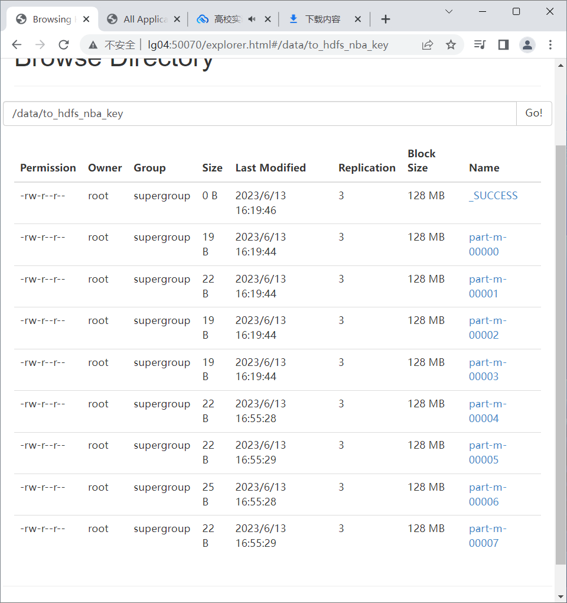

## 增量导出

> 将增量增加的文件导出给mysql

##### 进入/opt/apps/sqoop-1.4.7.bin__hadoop-2.6.0/bin目录下

```
cd /opt/apps/sqoop-1.4.7.bin__hadoop-2.6.0/bin
```

##### 执行导出

> 将part-m-00004导入nba_result表

```
./sqoop export --connect jdbc:mysql://LG04:3306/test --username root --password root --table nba_result --export-dir /data/to_hdfs_nba_key/part-m-00004 --fields-terminated-by ',' --lines-terminated-by '\n'
```

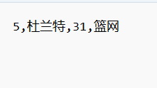

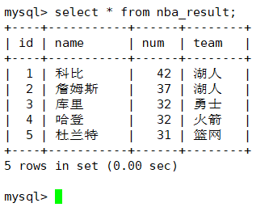
