# 克隆主机

## 将LG04关机在VMware中按以下步骤操作

​	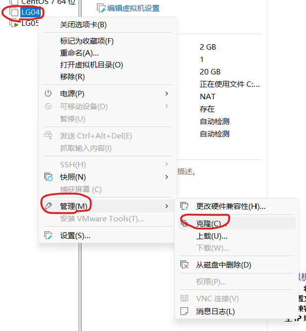

## 点击下一步

​	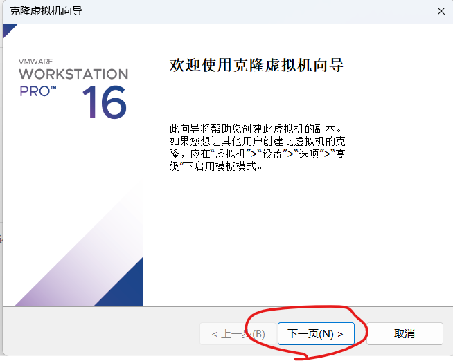

## 点击下一步

​	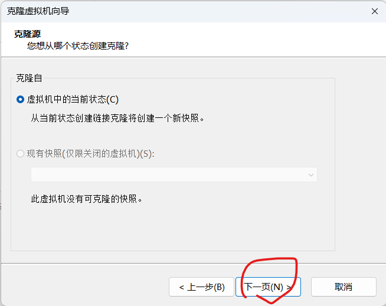

## 选择创建完整克隆，点击下一步

​	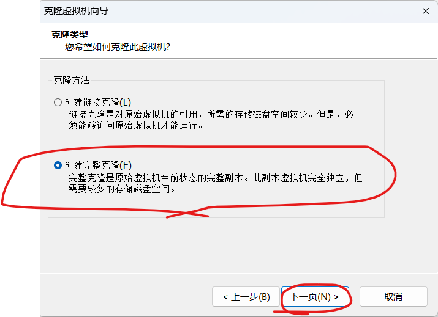

## 输入名称，地址，点击完成

​	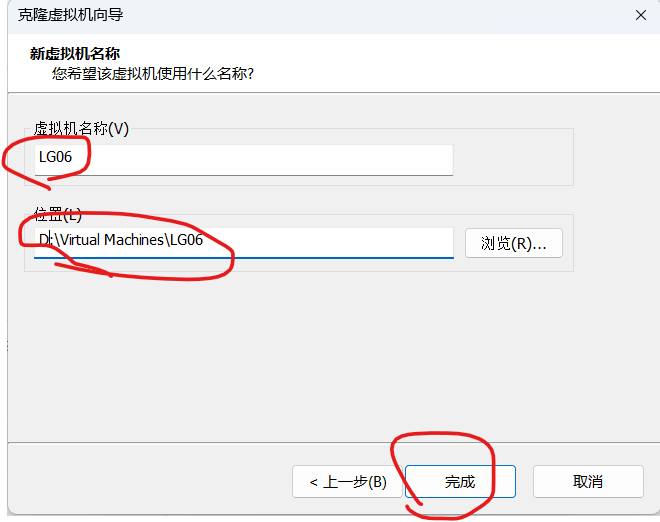

## 开启LG06		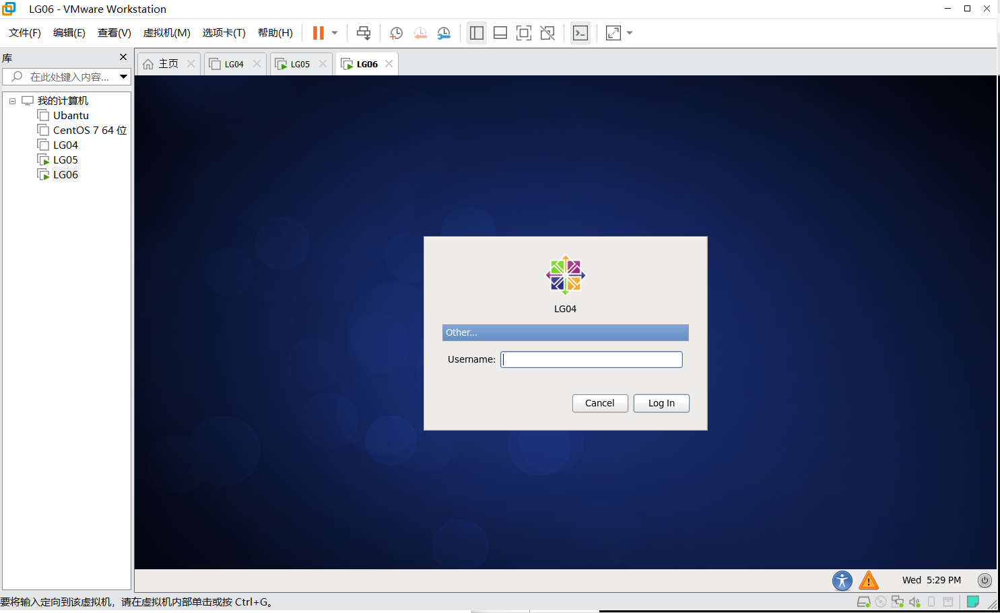

## 更改主机名为LG06

```
vim /etc/sysconfig/network
```

​	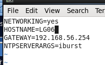

## 删除NAME="eth0"旧网卡删除，将新网卡NAME="eth1"改为"eth0"，复制新的ipv6地址ATTR{address}="ipv6的值"

```
vim /etc/udev/rules.d/70-persistent-net.rules
```

​	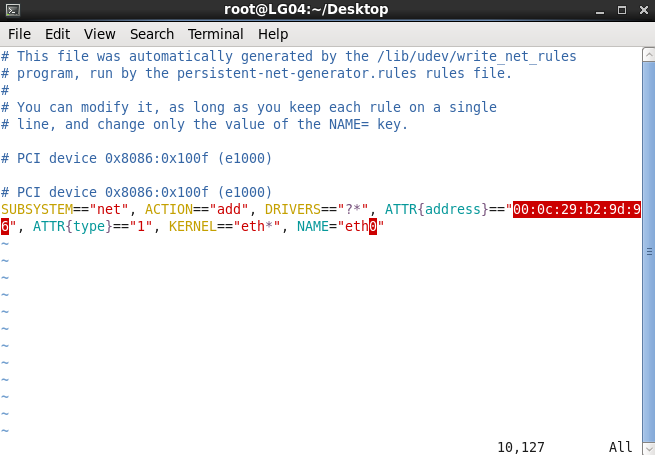

## 修改网卡配置，更改复制的ipv6地址，改静态ipv4地址

```
vim /etc/sysconfig/network-scripts/ifcfg-eth0
```

​	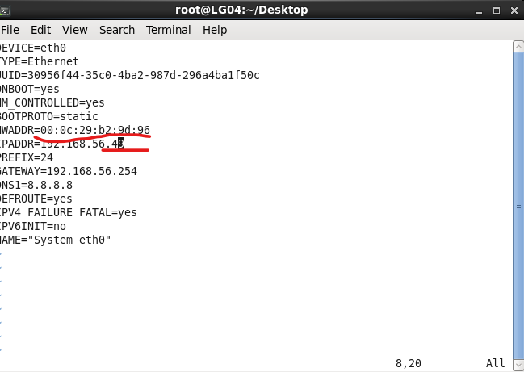

## 重启LG06

```
reboot
```

## ping www.baidu.com，发现能够ping通

```
ping www.baidu.com
```

​	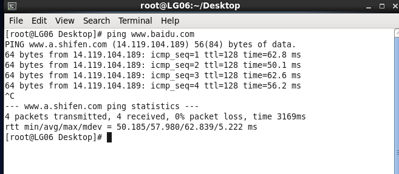

## 查看LG04、LG05、LG06IP地址

```
ifconfig
```

​	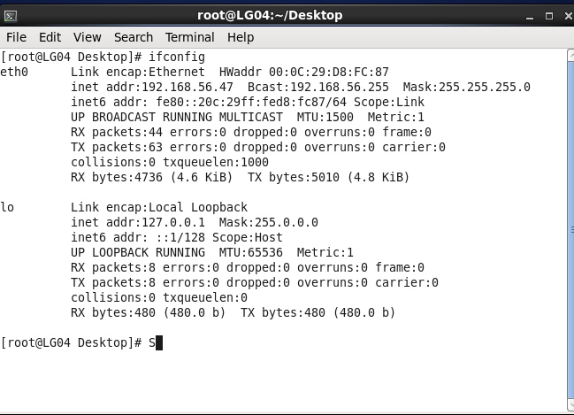

​	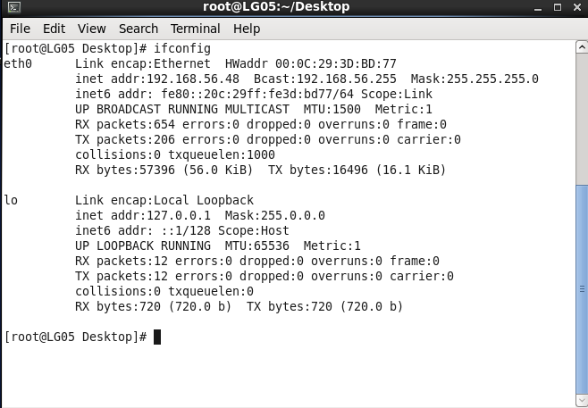

​	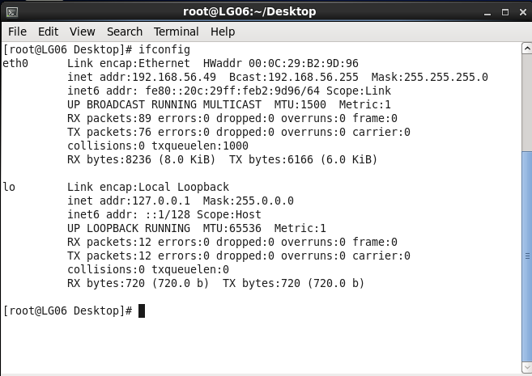

## 使用xshell连接LG04、LG05、LG06

​	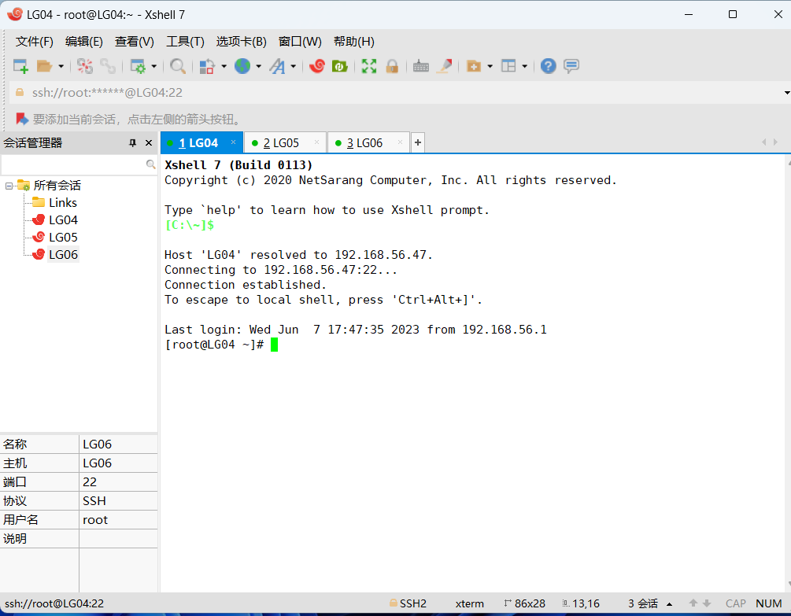

