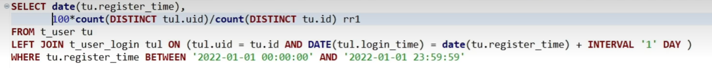

##### hive

```
drop table if exists `gmall1.ods_order_info`;
create external table `gmall1.ods_order_info` (
`id` string COMMENT '订单号',
`order_status` string COMMENT '订单状态',
`user_id` string COMMENT '用户id',
`payment_way` string COMMENT '支付方式',
`out_trade_no` string COMMENT '支付流水号',
`create_time` string COMMENT '创建时间',
`operate_time` string COMMENT '操作时间'
) COMMENT '订单表'
PARTITIONED BY (`dt` string)
row format delimited fields terminated by ','
STORED AS TEXTFILE
location '/gmall1_data/order_info/data';
```

```
drop table if exists `gmall1.ods_order_detail`;
create external table `gmall1.ods_order_detail`(
`id` string COMMENT '订单编号',
`order_id` string COMMENT '订单号',
`user_id` string COMMENT '用户id',
`sku_id` string COMMENT '商品id',
`sku_num` bigint COMMENT '商品数量',
`create_time` string COMMENT '创建时间'
) COMMENT '订单详情表'
PARTITIONED BY (`dt` string)
row format delimited fields terminated by ','
STORED AS TEXTFILE
location '/gmall1_data/order_detail/data';
```

```
drop table if exists `gmall1.ods_sku_info`;
create external table `gmall1.ods_sku_info`(
`id` string COMMENT 'skuId',
`spu_id` string COMMENT 'spuid',
`price` decimal(10,2) COMMENT '价格',
`sku_name` string COMMENT '商品名称',
`sku_desc` string COMMENT '商品描述',
`weight` string COMMENT '重量',
`tm_id` string COMMENT '品牌id',
`category3_id` string COMMENT '品类id',
`create_time` string COMMENT '创建时间'
) COMMENT 'SKU商品表'
PARTITIONED BY (`dt` string)
row format delimited fields terminated by ','
STORED AS TEXTFILE
location '/gmall1_data/sku_info/data';
```

```
drop table if exists `gmall1.ods_user_info`;
create external table `gmall1.ods_user_info`(
`id` string COMMENT '用户id',
`name` string COMMENT '姓名',
`birthday` string COMMENT '生日',
`gender` string COMMENT '性别',
`email` string COMMENT '邮箱',
`user_level` string COMMENT '用户等级',
`create_time` string COMMENT '创建时间'
) COMMENT '用户表'
PARTITIONED BY (`dt` string)
row format delimited fields terminated by ','
STORED AS TEXTFILE
location '/gmall1_data/user_info/data';
```

```
drop table if exists `gmall1.ods_base_category1`;
create external table `gmall1.ods_base_category1`(
`id` string COMMENT 'id',
`name` string COMMENT '名称'
) COMMENT '商品一级分类表'
row format delimited fields terminated by ','
STORED AS TEXTFILE
location '/gmall1_data/base_category1/data/data1';
```

```
drop table if exists `gmall1.ods_base_category2`;
create external table `gmall1.ods_base_category2`(
`id` string COMMENT 'id',
`name` string COMMENT '名称',
`category1_id` string COMMENT '一级品类id'
) COMMENT '商品二级分类表'
row format delimited fields terminated by ','
STORED AS TEXTFILE
location '/gmall1_data/base_category2/data/data1';
```

```
drop table if exists `gmall1.ods_base_category3`;
create external table `gmall1.ods_base_category3`(
`id` string COMMENT ' id',
`name` string COMMENT '名称',
`category2_id` string COMMENT '二级品类id'
) COMMENT '商品三级分类表'
row format delimited fields terminated by ','
STORED AS TEXTFILE
location '/gmall1_data/base_category3/data/data1';
```

```
drop table if exists `gmall1.ods_payment_info`;
create external table `gmall1.ods_payment_info`(
`id` bigint COMMENT '编号',
`out_trade_no` string COMMENT '对外业务编号',
`order_id` string COMMENT '订单编号',
`user_id` string COMMENT '用户编号',
`alipay_trade_no` string COMMENT '支付宝交易流水编号',
`subject` string COMMENT '交易内容',
`payment_type` string COMMENT '支付类型',
`payment_time` string COMMENT '支付时间'
) COMMENT '支付流水表'
PARTITIONED BY (`dt` string)
row format delimited fields terminated by ','
STORED AS TEXTFILE
location '/gmall1_data/payment_info/data';
```


##### shell脚本

```
./sqoop import \
--connect jdbc:mysql://LG02:3306/gmall1?characterEncoding=utf-8 \
--username root \
--password root \
--query "$2 and \$CONDITIONS" -m 1 \
--target-dir /gmall1_data/$1/data/$do_date \
--delete-target-dir \
--fields-terminated-by "," \
--lines-terminated-by "\n" \
--null-string '\\N' \
--null-non-string '\\N';
```


```
#! /bin/bash

sqoop=/opt/apps/sqoop-1.4.7.bin__hadoop-2.6.0/bin/sqoop
do_date=`date -d '-1 day' +%F`

if [ -n "$2" ]; then
    do_date=$2
fi

import_data(){
$sqoop import \
--connect jdbc:mysql://LG02:3306/gmall1?characterEncoding=utf-8 \
--username root \
--password root \
--query "$2 and \$CONDITIONS" -m 1 \
--target-dir /gmall1_data/$1/data/$do_date \
--delete-target-dir \
--fields-terminated-by "," \
--lines-terminated-by "\n" \
--null-string '\\N' \
--null-non-string '\\N';
}


import_order_info(){
  import_data "order_info" "select
                            id, 
                            order_status, 
                            user_id,
                            payment_way,
                            out_trade_no, 
                            create_time, 
                            operate_time      
                        from order_info
                        where (date_format(create_time,'%Y-%m-%d') = '$do_date' 
                        or date_format(operate_time,'%Y-%m-%d') = '$do_date')"
}


import_user_info(){
  import_data "user_info" "select 
                            id,
                            name,
                            birthday,
                            gender,
                            email,
                            user_level, 
                            create_time
                          from user_info 
                          where DATE_FORMAT(create_time,'%Y-%m-%d') = '$do_date'"
}

import_order_detail(){
  import_data "order_detail" "select 
                              od.id,
                              order_id, 
                              user_id, 
                              sku_id,
                              sku_num, 
                              od.create_time  
                            from order_detail od
                            join order_info oi
                            on od.order_id = oi.id
                            where DATE_FORMAT(od.create_time,'%Y-%m-%d') = '$do_date'"
}

import_payment_info(){
  import_data "payment_info"  "select 
                                id,  
                                out_trade_no, 
                                order_id, 
                                user_id, 
                                alipay_trade_no,  
                                subject, 
                                payment_type, 
                                payment_time 
                              from payment_info 
                              where DATE_FORMAT(payment_time,'%Y-%m-%d') = '$do_date'"
}


import_sku_info(){
  import_data "sku_info" "select 
                          id,
                          spu_id,
                          price,
                          sku_name,
                          sku_desc,
                          weight,
                          tm_id,
                          category3_id,
                          create_time
                        from sku_info 
                        where DATE_FORMAT(create_time,'%Y-%m-%d') = '$do_date'"
}

import_base_category1(){
  import_data "base_category1"  "select 
                                  id,
                                  name 
                                from base_category1 where 1=1"
}

import_base_category2(){
  import_data "base_category2"  "select
                                  id,
                                  name,
                                  category1_id 
                                from base_category2 where 1=1"
}

import_base_category3(){
  import_data "base_category3"  "select
                                  id,
                                  name,
                                  category2_id
                                from base_category3 where 1=1"
}


case $1 in
  "order_info")
     import_order_info
;;
  "base_category1")
     import_base_category1
;;
  "base_category2")
     import_base_category2
;;
  "base_category3")
     import_base_category3
;;
  "order_detail")
     import_order_detail
;;
  "sku_info")
     import_sku_info
;;
  "user_info")
     import_user_info
;;
  "payment_info")
     import_payment_info
;;

"first")
   import_base_category1
   import_base_category2
   import_base_category3
   import_order_info
   import_order_detail
   import_sku_info
   import_user_info
   import_payment_info
;;
"all")
   import_order_info
   import_order_detail
   import_sku_info
   import_user_info
   import_payment_info
;;
esac
```

```
./sqoop import \
--connect jdbc:mysql://LG02:3306/gmall1?characterEncoding=utf-8 \
--username root \
--password root \
--query "select
id,order_status,user_id,payment_way,out_trade_no,create_time,operate_time from
order_info where (date_format(create_time,'%Y-%m-%d')='2023-06-13' or
date_format(operate_time,'%Y-%m-%d')='2023-06-13') and \$CONDITIONS" -m 1 \
--target-dir /gmall1_data/order_info/data/2023-06-13 \
--fields-terminated-by "," \
--lines-terminated-by "\n" \
--null-string '\\N' \
--null-non-string '\\N';
```

```
./sqoop import --connect jdbc:mysql://LG02:3306/test --username root --password root --table base_category1 --target-dir /data/to_hdfs_nba_key --check-column id --incremental append --last-value 4
```

```
load data inpath '/gmall1_data/order_info/data/2023-06-13' OVERWRITE into table
`gmall1.ods_order_info` partition(`dt`='2023-06-13');
```

```
./sqoop import \
--connect jdbc:mysql://LG:3306/gmall1?characterEncoding=utf-8 \
--username root \
--password root \
--query "select id,name from base_category1 where 1=1 and \$CONDITIONS" -m 1 \
--target-dir /gmall1_data/base_category1/data/2020-07-25 \
--fields-terminated-by "," \
--lines-terminated-by "\n" \
--null-string '\\N' \
--null-non-string '\\N';
```

```
#!/bin/bash
APP=gmall1
hive=/opt/apps/apache-hive-1.2.2-bin/bin/hive
# 如果是输入的日期按照取输入日期；如果没输入日期取当前时间的前一天
if [ -n "$2" ]; then
do_date=$2
else
do_date=`date -d "-1 day" +%F`
fi
sql1="
load data inpath '/gmall1_data/order_info/data/$do_date' OVERWRITE into table
${APP}.ods_order_info partition(dt='$do_date');
load data inpath '/gmall1_data/order_detail/data/$do_date' OVERWRITE into table
${APP}.ods_order_detail partition(dt='$do_date');
load data inpath '/gmall1_data/sku_info/data/$do_date' OVERWRITE into table
${APP}.ods_sku_info partition(dt='$do_date');
load data inpath '/gmall1_data/user_info/data/$do_date' OVERWRITE into table
${APP}.ods_user_info partition(dt='$do_date');
load data inpath '/gmall1_data/payment_info/data/$do_date' OVERWRITE into table
${APP}.ods_payment_info partition(dt='$do_date');
load data inpath '/gmall1_data/base_category1/data/$do_date' OVERWRITE into
table ${APP}.ods_base_category1;
load data inpath '/gmall1_data/base_category2/data/$do_date' OVERWRITE into
table ${APP}.ods_base_category2;
load data inpath '/gmall1_data/base_category3/data/$do_date' OVERWRITE into
table ${APP}.ods_base_category3;
"
sql2="
load data inpath '/gmall1_data/order_info/data/$do_date' OVERWRITE into table
${APP}.ods_order_info partition(dt='$do_date');
load data inpath '/gmall1_data/order_detail/data/$do_date' OVERWRITE into table
${APP}.ods_order_detail partition(dt='$do_date');
load data inpath '/gmall1_data/sku_info/data/$do_date' OVERWRITE into table
${APP}.ods_sku_info partition(dt='$do_date');
load data inpath '/gmall1_data/user_info/data/$do_date' OVERWRITE into table
${APP}.ods_user_info partition(dt='$do_date');
load data inpath '/gmall1_data/payment_info/data/$do_date' OVERWRITE into table
${APP}.ods_payment_info partition(dt='$do_date');
"
case $1 in
"first")
$hive -e "$sql1"
;;
"all")
$hive -e "$sql2"
;;
esac
```

```
insert overwrite table `gmall1.dwd_order_info` partition(`dt` = '2023-06-15')
select
oi.`id`,
s4.`name`,
oi.`order_status`,
oi.`user_id`,
oi.`payment_way`,
oi.`out_trade_no`,
oi.`create_time`,
oi.`operate_time`
from
(select * from `gmall1.ods_order_info` where `dt` = '2023-06-15' and `id` is not null) oi
left join
(select `order_id`,`sku_id`,`sku_num` from `gmall1.ods_order_detail` where `dt` = '2023-06-15' and `id` is not null) od
on
oi.`id` = od.`order_id`
left join
(select `id`,`category3_id` from `gmall1.ods_sku_info` where `id` is not null) s1
on
od.`sku_id` = s1.`id`
left join
(select `id` from `gmall1.ods_base_category3` where `id` is not null) s2
on
s1.`category3_id` = s2.`id`
left join
(select `id` from `gmall1.ods_base_category2` where `id` is not null) s3
on
s2.`category2_id` = s3.`id`
left join
(select `id`,`name` from `gmall1.ods_base_category1` where `id` is not null) s4
on
s3.`category1_id` = s4.`id` 
group by 
oi.`id`,
oi.`order_status`,
oi.`user_id`,
oi.`payment_way`,
oi.`out_trade_no`,
oi.`create_time`,
oi.`operate_time`;
```

