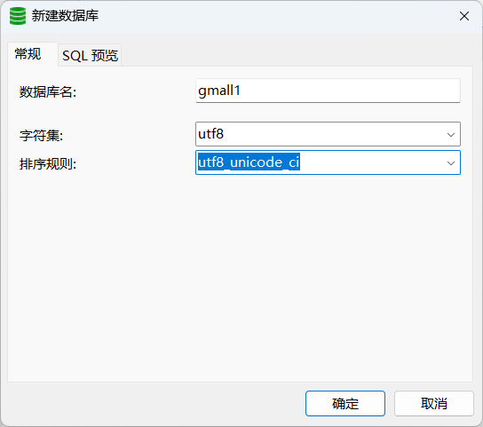
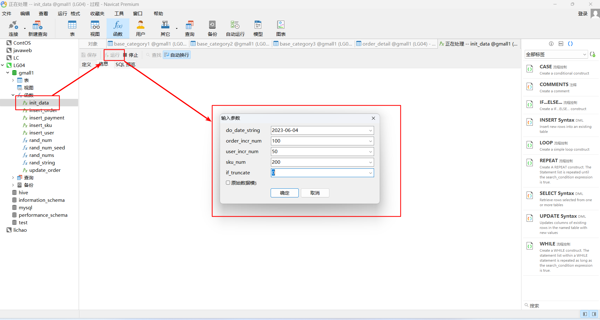
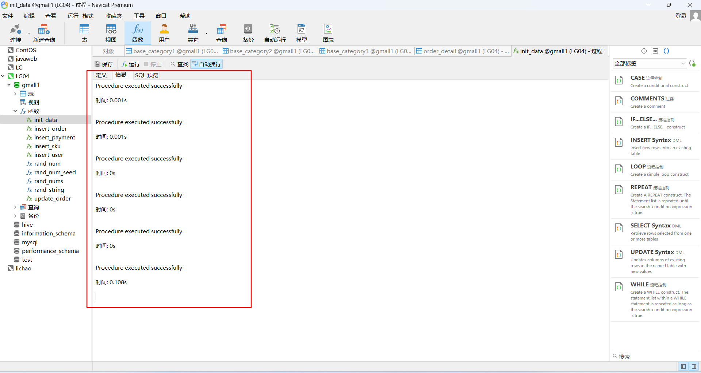
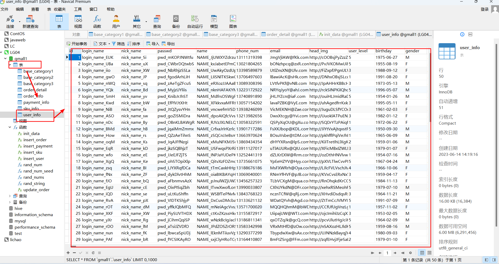
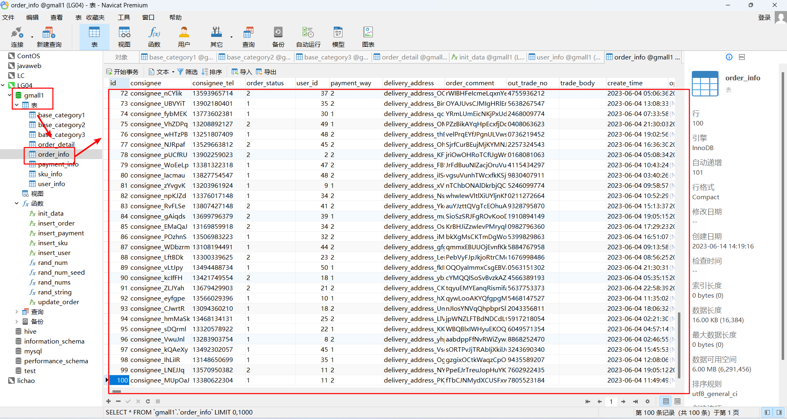
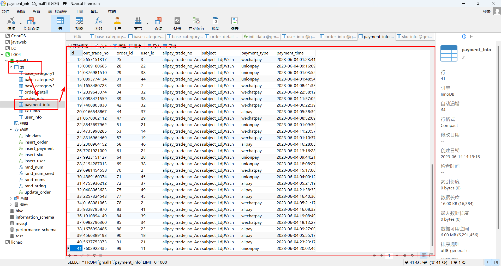
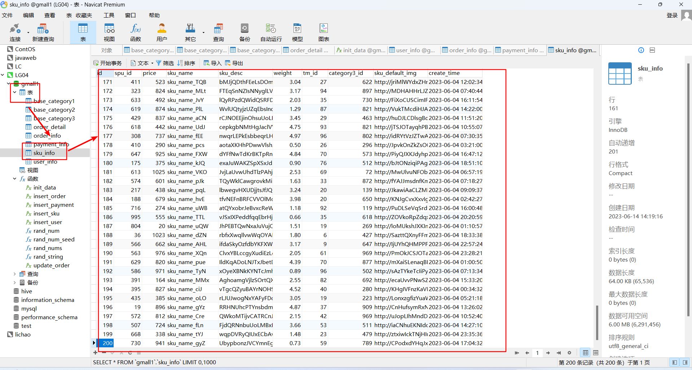
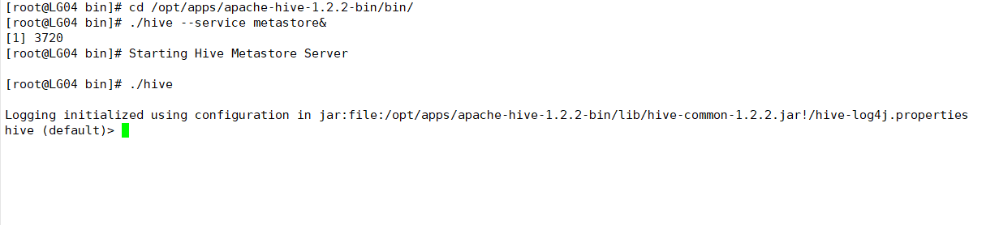
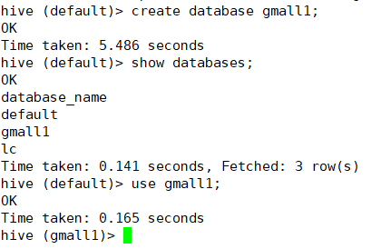

# 项目

> 工具：navicat、

### 数据库准备

##### 链接数据库


##### 创建数据库gmall1



##### 执行sql脚本


##### 数据库的分类


##### 执行函数sql脚本


##### 执行init_data函数

> 随机生成数据
>
> do_date_string	日期
>
> order_incr_num	订单
>
> user_incr_num	用户
>
> sku_num	商品
>
> if_truncate	0（追加）1（覆盖）













### 启动集群

##### 在LG04中启动dfs 在LG06中启动yarm

```
/opt/apps/hadoop-2.7.2/sbin/start-dfs.sh
/opt/apps/hadoop-2.7.2/sbin/start-yarn.sh
```

##### 启动hive

```
cd /opt/apps/apache-hive-1.2.2-bin/bin/
./hive --service metastore&
./hive
```



##### 创建gmall1数据库

```
create database gmall1;
use gmall1;
```



