# 1.安装nginx

在实验一的基础上，在/opt目录下创建src目录，并进入该目录，用于存放安装包

```linux
cd /opt
mkdir src
cd src
```

在src目录下安装nginx安装包

```linux
wget https://nginx.org/download/nginx-1.22.1.tar.gz
```

用ls指令查看nginx.gz压缩包，并用tar命令解压，解压完成后进入nginx文件

```linux
tar -zxvf nginx-1.22.1.tar.gz
cd nginx-1.22.1
```

ls指令查看该文件内容

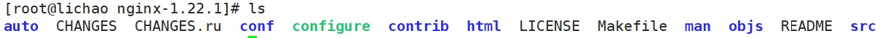

执行configure文件，之后再执行make install

```
./configure --prefix=/opt/nginx
make install
```

在此过程中如果缺少相关文件报错，执行以下代码，再重复上一步操作

```
yum install -y zlib-devel.x86_64 pcre2-devel.x86_64  #centOS
apt install -y zlib1g-dev libpcre2-dev #ubantu
```

进入/opt/nginx，查看该目录下内容


进入conf查看配置文件nginx.conf,默认80端口打开

```
server {
        listen       80;
        server_name  localhost;

        location / {
            root   html;
            index  index.html index.htm;
        }

        error_page   500 502 503 504  /50x.html;
        location = /50x.html {
            root   html;
        }
    }

```

输入以下代码，将防火墙打开

```
firewall-cmd --zone=public --add-port=80/tcp --permanent
systemctl restart firewalld.service
```

在网页中输入ip地址，通过80端口访问，如：192.168.101.100:80

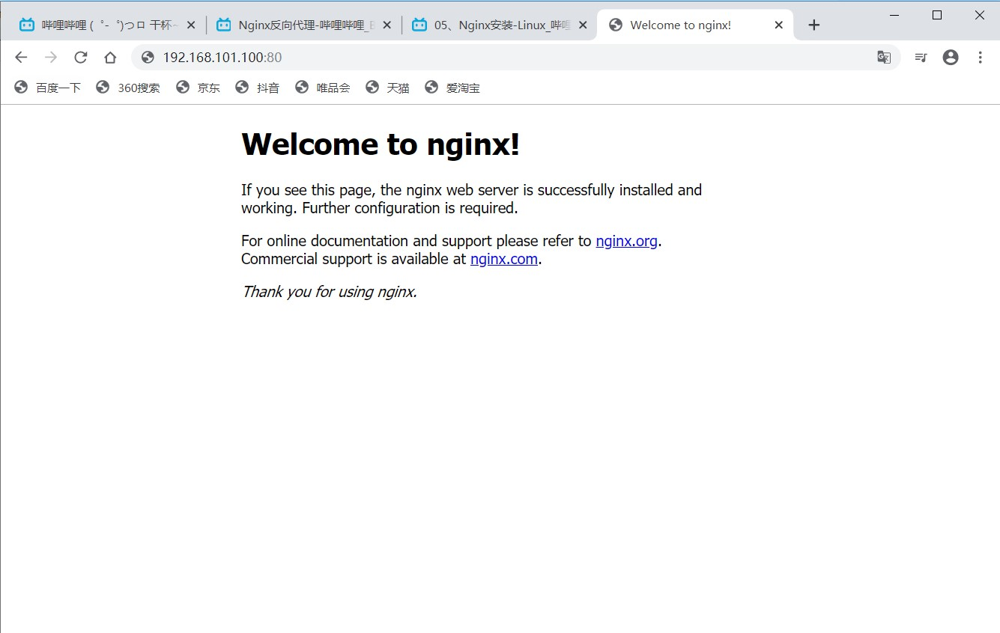

进入nginx目录下的html目录，编辑其中默认index界面

```
cd /opt/nginx/html

vim index.html
```

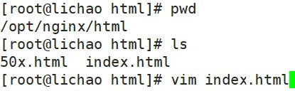

添加以下内容，并保存

```
<p>我是软件202班李超同学</p>
```

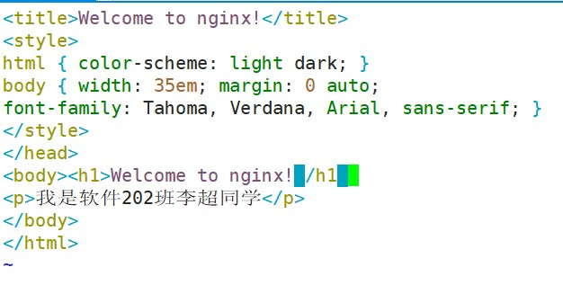

再次在网页中输入ip地址，通过80端口访问，如：192.168.101.100:80，发现中文部分乱码

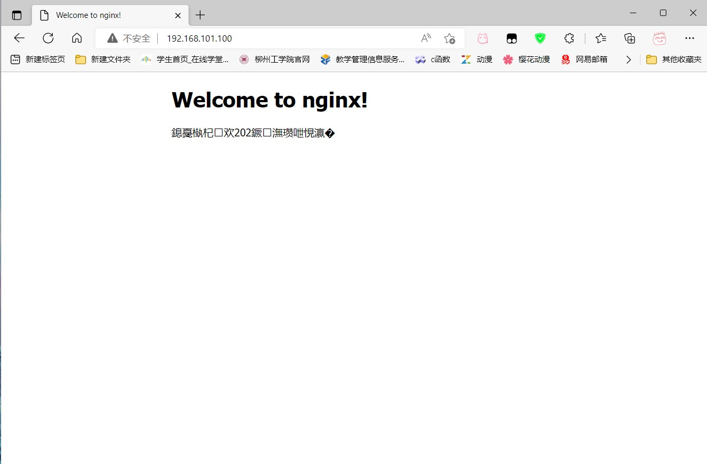

重新编辑index.html文件在<head></head>中加入网页的编码类型，如utf-8

```
<meta charset="UTF-8">
```

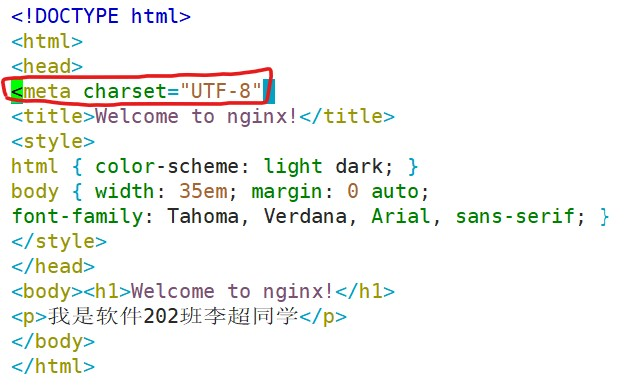

重新访问地址，发现内容正常输出

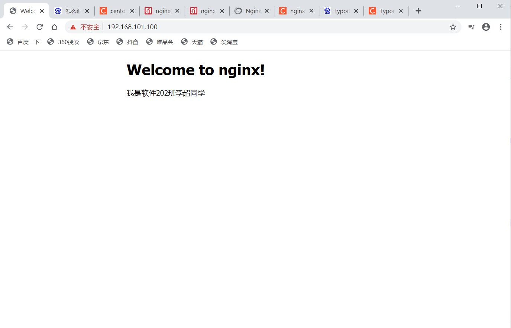

# 2.配置jdk

在/opt/src中下载jdk包

```linux
wget https://download.java.net/java/GA/jdk19.0.1/afdd2e245b014143b62ccb916125e3ce/10/GPL/openjdk-19.0.1_linux-x64_bin.tar.gz
```

解压到/usr/local/目录下，并编辑/etc/profile，添加以下内容到末尾，结束后使用source点命令，重新执行刚修改的初始化文件，使之立即生效，再输入java -version查看jdk版本来确定是否配置成功

```
tar -C /usr/local/ -zxvf openjdk-19.0.1_linux-x64_bin.tar.gz

vim /etc/profile

export JAVA_HOME=/usr/local/jdk-19.0.1
export PATH=$JAVA_HOME/bin:$PATH
export CLASSPATH=$JAVA_HOME/lib/dt.jar:$JAVA_HOME/lib/tools.jar

source /etc/profile
java -version
```

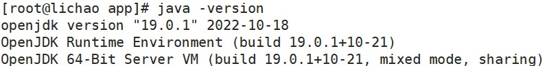

# 3.创建springboot工程

使用idea创建一个Springboot项目

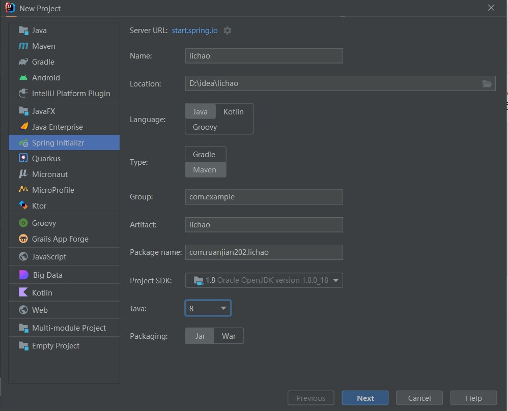

选择Spring Web

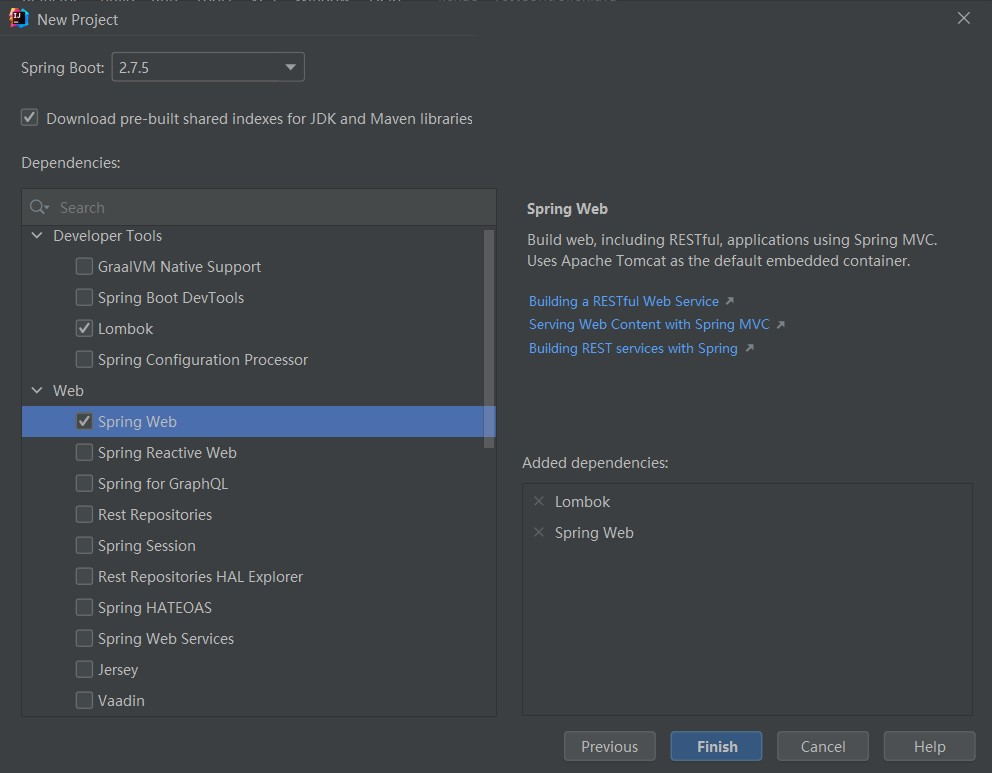

创建controllerbao包，并创建TextControllerlei类，编写以下方法

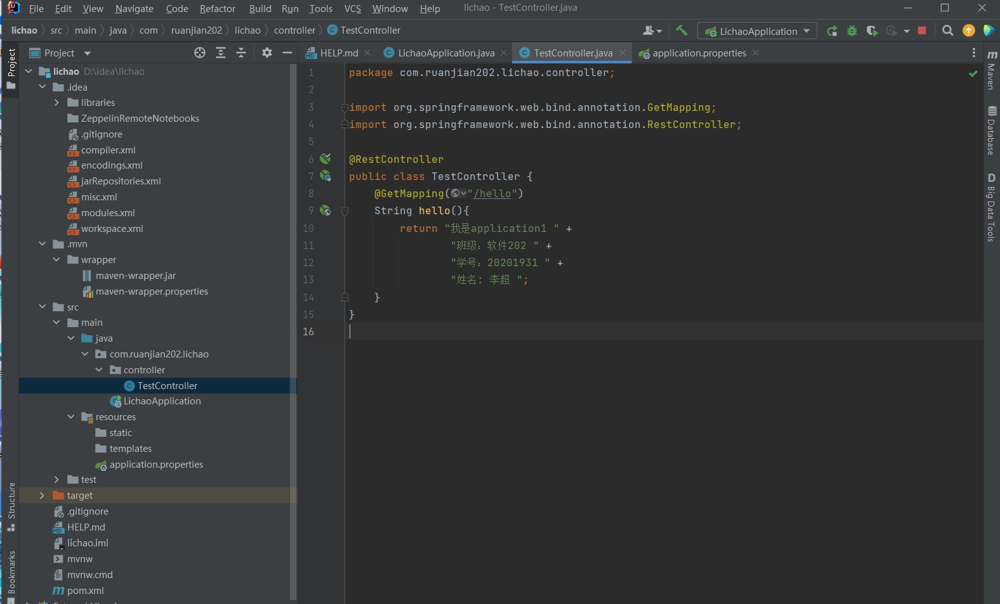

用浏览器访问localhost:8080/hello

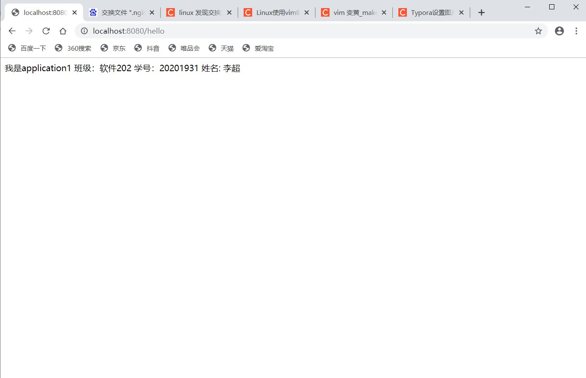

打包

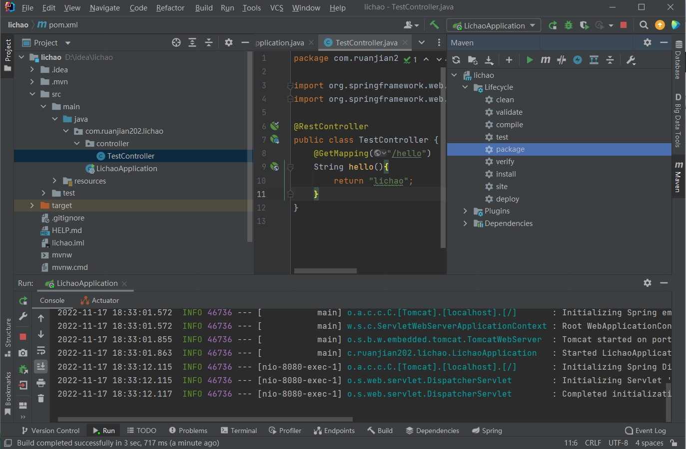

找到项目jar包

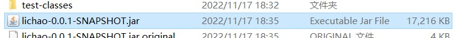

重复上述方法，再创建一个Springboot项目，将TextControllerlei类中hello方法返回值改成以下内容，并打包

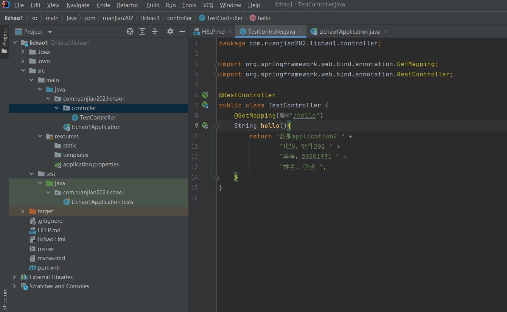

在/opt目录下创建app目录，并将jar包通过Xftp放入其中

```
cd /opt
mkdir app
cd app
```

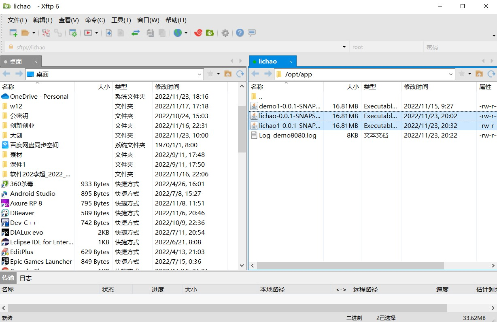

输入以下代码将java项目在后台执行，并重定向输入到Log_demo8080.log文件中

```
#负载均衡时通过8080和8081同时启动，运用权重来分配访问的频率
nohup java -jar lichao-0.0.1-SNAPSHOT.jar > Log_demo8080.log 2>&1 & 
nohup java -jar lichao1-0.0.1-SNAPSHOT.jar --server.port=8081 > Log_demo8081.log 2>&1 & 

ps aux | grep java

curl http://localhost:8080/hello
curl http://localhost:8081/hello
```

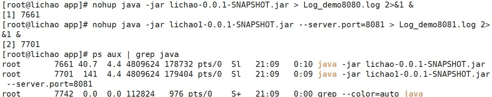

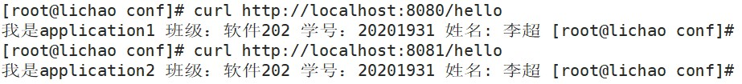

# 4.配置负载均衡

回到/opt/nginx/conf/目录下，vim编辑nginx.conf文件

```
cd /opt/nginx/conf/

vim nginx.conf
```

在nginx.conf中添加一个上游服务器，在这里配置负载均衡

```
upstream lichao
    { 
        server 127.0.0.1:8080 weight=1;
   		server 127.0.0.1:8081 weight=1;
    }
```

在nginx.conf中location将内容注释掉，并反向代理到负载均衡

```
location / {
            #root   html;
            #index  index.html index.htm;
            proxy_pass http://lichao;
        }
```

修改后重新加载一下配置文件

```
../sbin/nginx -t
../sbin/nginx -s reload
#如果报错：nginx: [error] invalid PID number "" in "/opt/nginx/logs/nginx.pid"
#执行以下指令
/opt/nginx/sbin/nginx -c /opt/nginx/conf/nginx.conf
```

再次访问ip地址

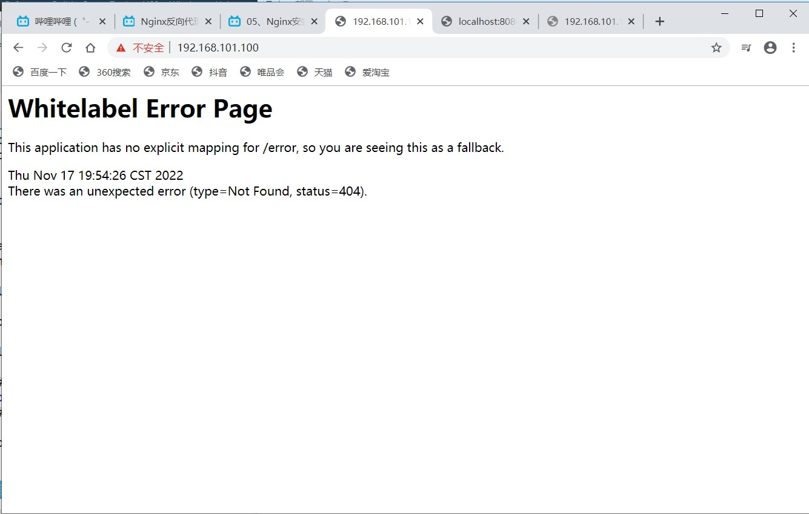

加入/hello后缀

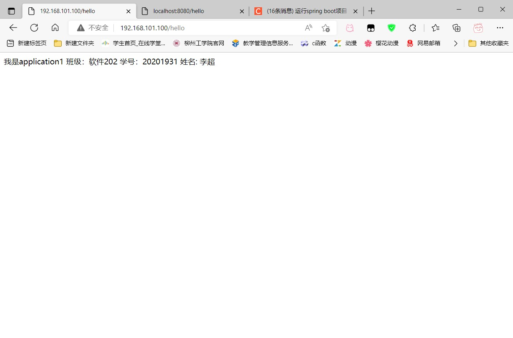

尝试不断刷新网页，可以发现内容中application1和application2在不断切换，确定能正确交替返回上述两个tomcat的内容

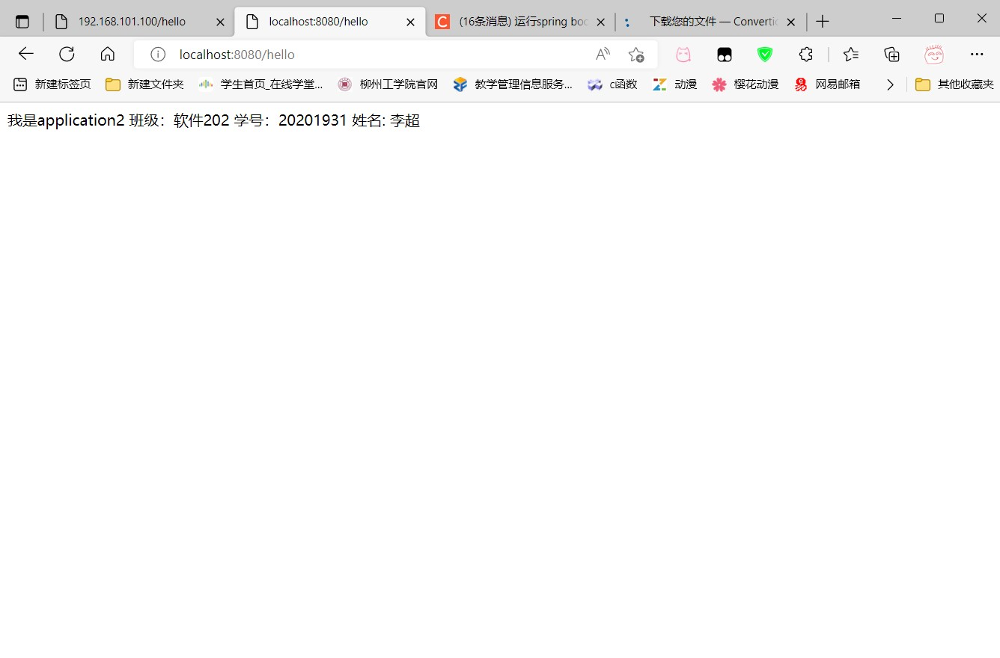

通过curl命令访问curl http://localhost/hello,也确认能正确交替返回上述两个tomcat的内容。

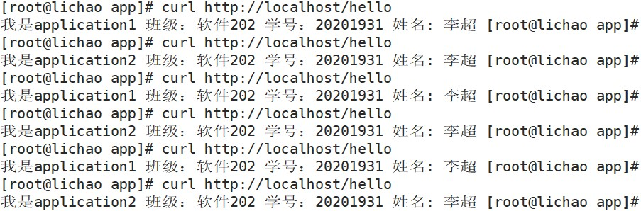