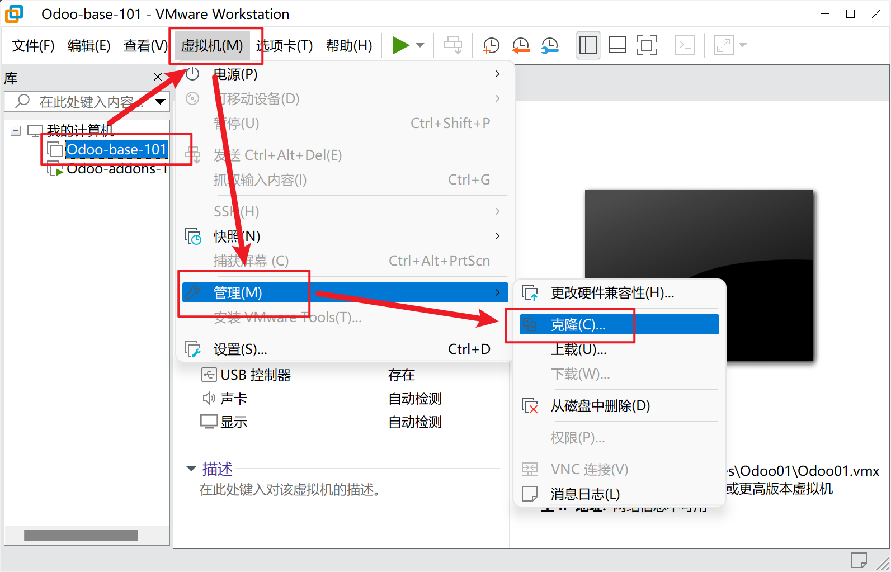
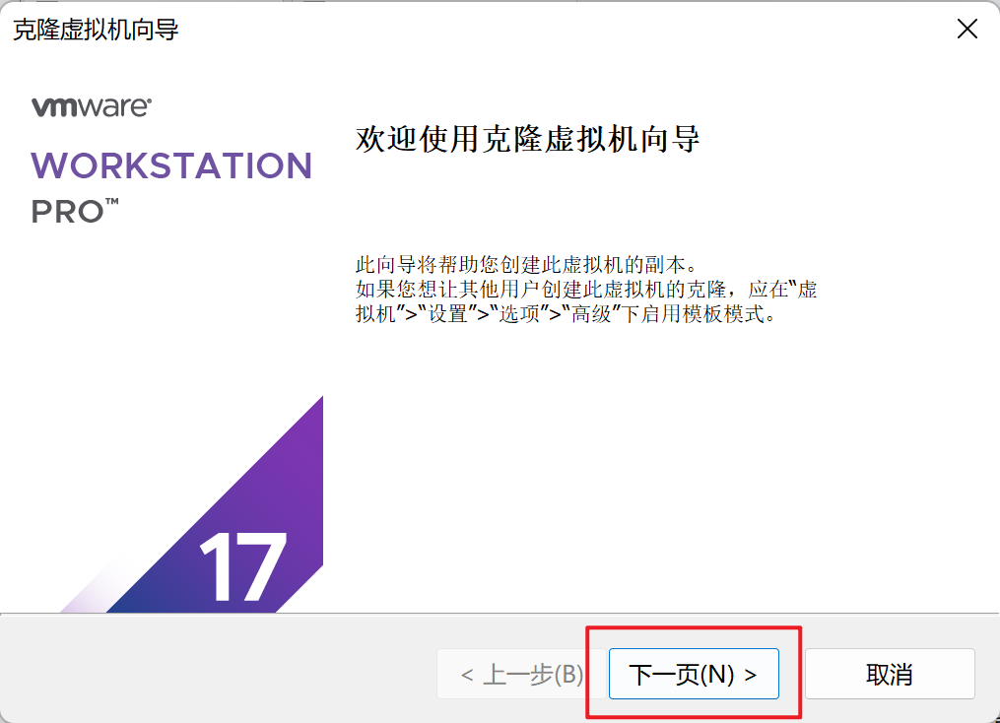
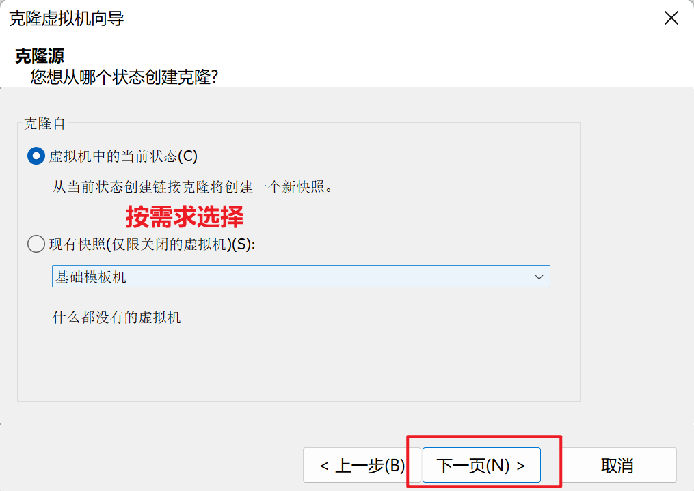
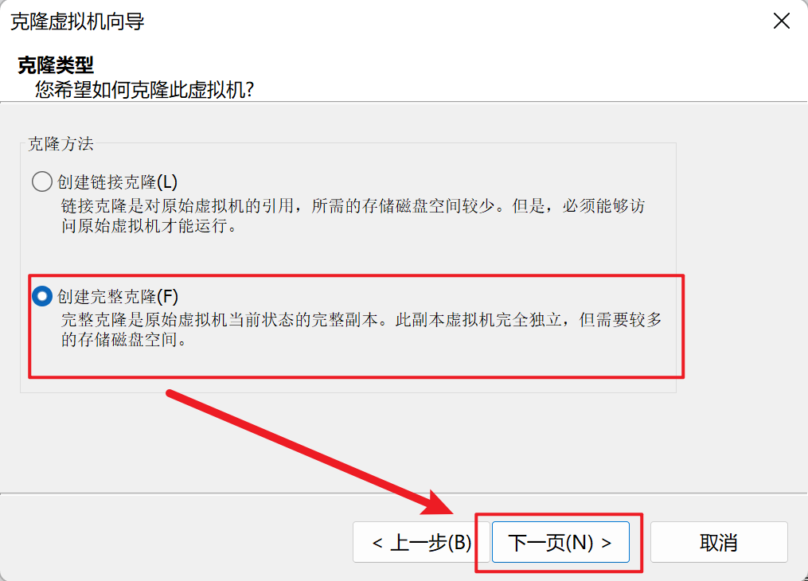
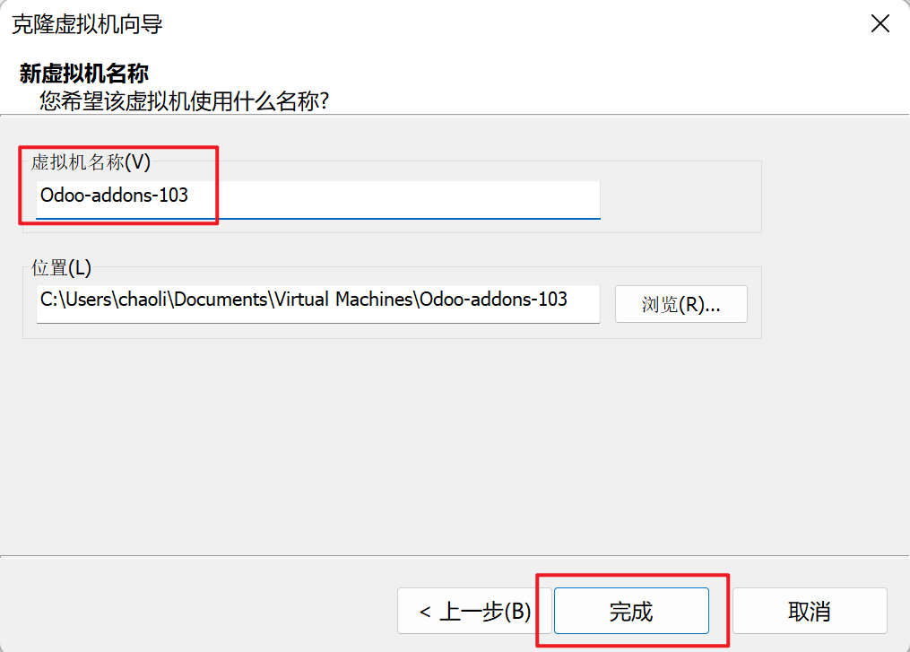

# 克隆模板机

## 克隆一个空的模块机











## 配置克隆的虚拟机

配置静态ip

```shell
sudo nano /etc/netplan/50-cloud-init.yaml
```

```shell
network:
  version: 2
  ethernets:
    ens33:
      addresses:
      - "192.168.100.103/24"
      nameservers:
        addresses:
        - 8.8.8.8
        search: []
      routes:
      - to: "default"
        via: "192.168.100.2"
```

```shell
sudo netplan apply
```

配置主机名

```shell
sudo hostnamectl set-hostname odoo-addons-103
```

```shell
sudo nano /etc/hosts
```

```shell
127.0.0.1 localhost
127.0.1.1 odoo-addons-103

# The following lines are desirable for IPv6 capable hosts
::1     ip6-localhost ip6-loopback
fe00::0 ip6-localnet
ff00::0 ip6-mcastprefix
ff02::1 ip6-allnodes
ff02::2 ip6-allrouters
```

```shell
sudo reboot
```
